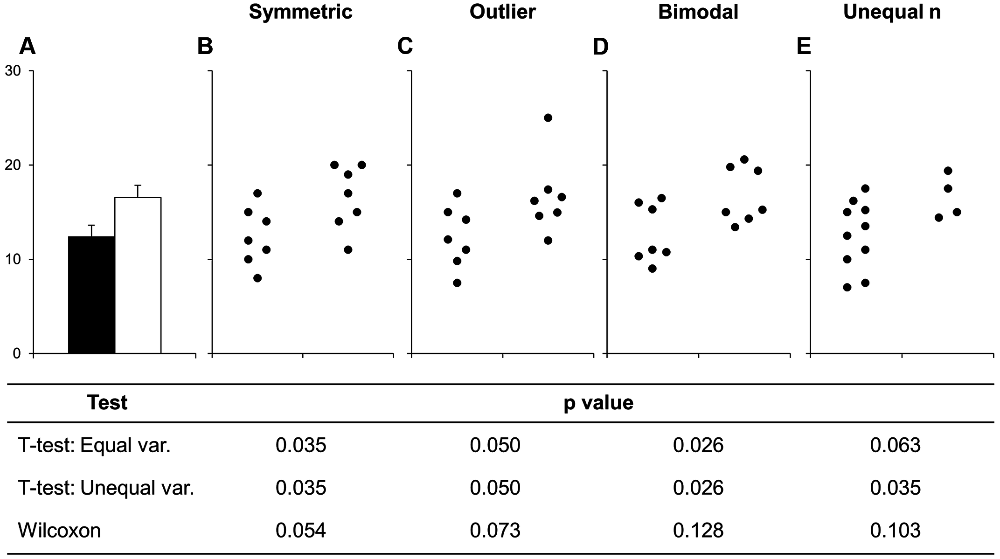
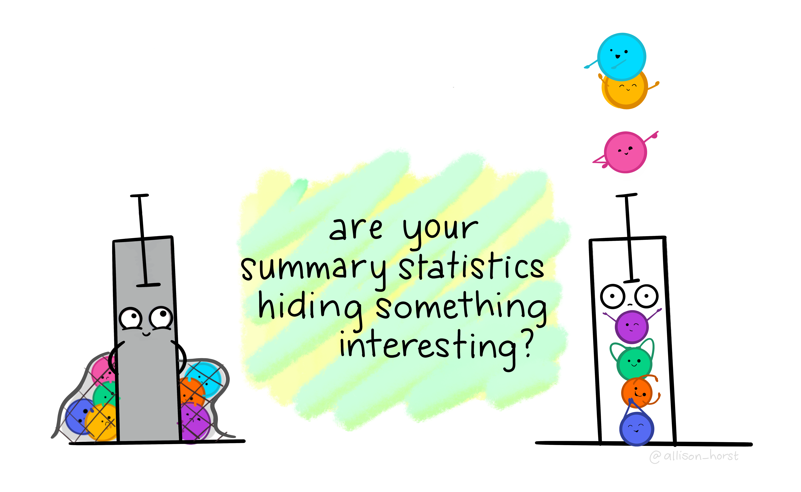
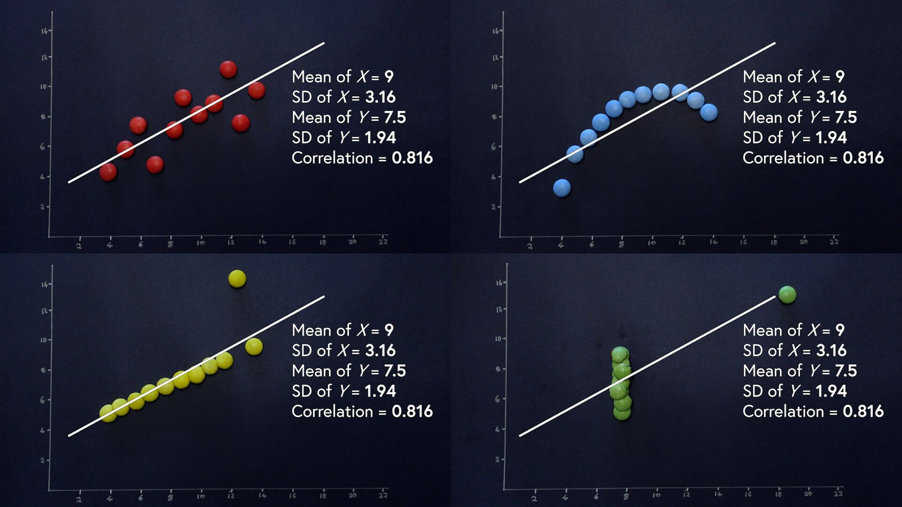

# When in doubt - plot it out {#sec-visualization}

> "The simple graph has brought more information to the data analyst's mind than
> any other device." --- John Tukey

```{r}
#| label: setup
#| include: false

#library(tidyverse)
#ddagit782594dalibrary(tidyverse)
library(ggplot2)
library(dplyr)
library(readr)
library(tidyr)

#hd_data <- readr::read_csv(
#  "https://raw.githubusercontent.com/DanMazJen/medicinsk-statistik/main/data/hd_data.csv"
#)
data(hd_data, package = "medisr")
```

## Pree-class Literature



# Slides

> [**Session 4 slides**](../slides/day4.html)

<div>

```{=html}
<iframe class="slide-deck" src="../slides/day4.html"></iframe>
```

</div>

::: {.callout-note collapse="true"}
## Teacher note

The slides contain speaking notes that you can view by pressing 'S' on the
keyboard.
:::

## Case session 4: "Let's first see what the data are telling us"

A research group at AalboR University is reviewing data collected from patients
undergoing exercise-based cardiac assessment. The dataset contains information
such as age, maximum heart rate reached during exercise, and whether the patient
experienced exercise-induced angina during the assessment.

The research team is initially interested in a fairly simple question:

> How does maximum heart rate during exercise vary with age?

Before drawing any conclusions from the data, however, the team wants to
understand what the relationship actually looks like in their patient
population.

During a research meeting, a colleague points out:

> "We know that age and exercise heart rate are related, but I don't want us to
> assume that the same pattern necessarily applies to everyone in the dataset.
> Let's first see what the data are telling us."

The Professor asks you to start by exploring the distribution of maximum heart
rate and comparing patients with and without exercise-induced angina. Finally,
examine how maximum heart rate changes across age.

## Reading Task: Why Visualize Data?

In medicine, pharmaceuticals, and healthcare, data is everywhere --- patient
records, clinical trials, drug efficacy studies, hospital operations, and more.
But raw numbers alone don't tell the full story. Data visualization turns
complex information into clear, actionable insights which effectively aids you
(and your future colleagues) make faster, smarter decisions.

Which of these are easiest to draw information from:

::: panel-tabset
### Table

```{r}
#| echo: false
#| warning: false
#| label: viz-is-powerful

x <- seq(0, 2 * pi, length.out = 20)
y <- round(sin(x) * 10, 1)

dat <- data.frame(month = x, temperature = y)

dat |>
  gt::gt()
```

### Plot

```{r}
#| label: viz-is-powerful2
#| echo: false
#| warning: false

dat |>
  ggplot2::ggplot(ggplot2::aes(month, temperature)) +
  ggplot2::geom_point()
```
:::

Good visualizations help you:

- Spot patterns (e.g., a sudden spike in adverse drug reactions)
- Communicate findings (e.g., convincing a hospital board to adopt a new
  protocol)
- Avoid mistakes (e.g., misreading a critical lab value in a dense table)

[The Royal Statistical
Society](https://royal-statistical-society.github.io/datavisguide/docs/why-visualise.html)
propose five key reasons to visualize data

(1) Grab Attention

> A plot with a red alert trendline for rising infections will get more
> attention than a 10-page report.

(2) Improve access to information

> Doctors, nurses, and politicians don't have time to parse dense tables.

(3) Increase precision

> A plot can contextualize data better than any table could using the same print
> space.

(4) Bolster credibility

> Visualizations lets stakeholders *"see"* the evidence for themselves.
> Regulators and investors demand transparency --- visuals provide it.

(5) Summarise content

> A single infographic can replace several pages of text.

Data visualization isn't just about "making things look nice". It's a critical
skill for being able to evaluate any scientific claim. Through this class, we'll
dive into how to choose the right visualization for a given data structure and
how to avoid common mistakes.

## Discussion activity: Your experience with data visualization:

- Where do you see data visualization "in the wild"?
- What makes you trust a figure/graph? What could make you distrust it?
- What's one type of data you've seen in your studies/clinical rotations that
  was able to provide a lot of (valuable) information using a visualization?

## Exercise: Conceptualization of a plot

Do older patients have higher or lower max heart rate than younger patients? You
probably already have an answer, but try to make your answer precise.

What does the relationship between age and max heart rate look like? Is it
positive? Negative? Linear? Nonlinear? Does the relationship vary by the
presence of exercise-induced angina in the patient?

Before we create visualizations that we can use to answer these questions, try
drawing your expectations using pen and paper.

You can do it in many ways --- this is also part of the exercises!

**alone**

- make a plot stating your expectations about the relationship between age and
  max haeart rate.
- now, make a new plot adding information about exercise-induced angina-

**in pairs**

- can the other person interpret your plot?
- do your plots differ --- how?
- which is more clear and why --- which features makes it better/worse?

## Setting up for success:

Recall from @sec-rproj that we want a project to contain our files. In this
session, we'll make a new project called: *plotting-data*.

Recall we can use RStudio's "New Project" menu item under "File -> New
Project...". A new pop-up window shows up. Click "New directory" and scroll down
to "Scientific Analysis Project using prodigenr". Type out `plotting-data` as
the directory name and save it to the `Desktop/`.

### Terminology

To make the communication easier, let's define some terms (we use the
definitions from [@R4DS])

- A **variable** is a quantity, quality, or property that you can measure.

- A **value** is the state of a variable when you measure it. The value of a
  variable may change from measurement to measurement.

- An **observation** is a set of measurements made under similar conditions (you
  usually make all of the measurements in an observation at the same time and on
  the same object). An observation will contain several values, each associated
  with a different variable. We'll sometimes refer to an observation as a data
  point.

- **Tabular data** is a set of values, each associated with a variable and an
  observation. Tabular data is *tidy* if each value is placed in its own "cell",
  each variable in its own column, and each observation in its own row.

In this context, a variable refers to an attribute of all the patients, and an
observation refers to all the attributes of a single patient.

Load the data and type the name of the data frame in the console and R will
print a preview of its contents.

```{r}
#| label: read-data
#| output: false
#| filename: "docs/session4.R"

hd_data <- medisr::hd_data
```

Recall from @sec-introduction that you can use the **console**
@fig-rstudio-introduction to interactively explore the data either by

- pasting the dataset variable `hd_data` and pressing `Enter` directly in the
  console, or
- writing a line within a script `.R` file, resting the cursor on that line, and
  typing  --- this will directly send the code to
  the console.

```{r}
#| label: see-data
#| filename: "docs/session4.R"

hd_data # your cursor must be here!
```

Among the variables in `hd_data` are:

1. `ExAng `: whether a patient experienced exercises-induced angina.

2. `Age`: how old a patient was at the time of the measurement (in years).

3. `MaxHR`: the max heart rate value we measured.

## Ultimate goal {#sec-ultimate-goal}

Our ultimate goal in this session is to recreate the following visualization
displaying the relationship between max heart rate vs. age of patients with and
without exercise-induced angesia.

```{r}
#| label: ultimate-goal
#| echo: false
#| warning: false
#| fig-alt: |
#|   A scatterplot of max heart rate vs. age of patients with and without exercise-induced angesia, with a
#|   line of the relationship between these two variables
#|   overlaid. The plot displays a negative, fairly linear, and relatively
#|   strong relationship between these two variables. exercise-induced angesia (yes/no) is represented with different colors.
#|   The relationship between body mass and flipper length is
#|   roughly steeper for the patient group without exercise-induced angesia (0).

hd_data |>
  dplyr::mutate(
    ExAng=factor(
        ExAng,levels=c(0,1),
        labels=c("No", "Yes")
        )
  ) |>
  ggplot2::ggplot(ggplot2::aes(Age, MaxHR, color = ExAng)) +
  ggplot2::geom_point() +
  ggplot2::geom_smooth(method = "loess")

# and
#hd_data |>
#  ggplot2::ggplot(ggplot2::aes(as.factor(ExAng), MaxHR)) +
#  ggplot2::geom_boxplot()

# and

#hd_data |>
#  ggplot2::ggplot(ggplot2::aes(as.factor(ExAng), MaxHR)) +
#  ggplot2::stat_summary(geom = "col", fun = mean) +
#  ggplot2::stat_summary(
#    fun.data = "mean_cl_boot", # The 95% confidence interval of the mean     # "mean_cl_normal" # mean_sdl
#    geom = "errorbar",
#    width = 0.15
#  )
```

## Reading task: Hallo `{ggplot2}`

R has several systems for making graphs, but `{ggplot2}` is one of the most
elegant and most versatile. `{ggplot2}` implements the **grammar of graphics**,
a coherent system for describing and building graphs. With `{ggplot2}`, you can
do more and faster by learning one system and applying it in many places.

`{ggplot2}` is an implementation of the ["Grammar of
Graphics"](https://www.springer.com/gp/book/9780387245447) ("gg"). This is a
powerful approach to creating plots because it provides a set of structured
rules (a "grammar") that allow you to expressively describe components (or
"layers") of a graph. Since you are able to describe the components, it is
easier to then implement those "descriptions" in creating a graph. According to
[@Johnston2021], there are at least four aspects to using `{ggplot2}` that
relate to its "grammar":

- Aesthetics, `aes()`: How data are mapped to the plot, including what data are
  put on the x and y axes, and/or whether to use a colour for a variable.
- Geometries, `geom_` functions: Visual representation of the data, as a layer.
  This tells `{ggplot2}` how the aesthetics should be visualized, including
  whether they should be shown as points, lines, boxes, bins, or bars.
- Scales, `scale_` functions: Controls the visual properties of the `geom_`
  layers. Can be used to modify the appearance of the axes, to change the colour
  of dots from, e.g., red to blue, or to use a different colour palette
  entirely.
- Themes, `theme_` functions or `theme()`: Directly controls all other aspects
  of the plot, such as the size, font, and angle of axis text, and the thickness
  or colour of the axis lines.

There is a massive amount of features in `{ggplot2}`. Thankfully, `{ggplot2}`
was specifically designed to make it easy to find and use its functions and
settings using tab auto-completion. To demonstrate this feature, try typing out
`geom_` and you'll start seeing a menu pop-up with a list of functions that
start with `geom_`. You can then use the arrow keys to move up and down the list
and then hit either `Enter` or `Tab` to select the function. You can use this
with `scale_` or the options inside `theme()`, for instance try typing out
`theme(axis.` to see all options for the axis a list of theme settings related
to the axis will pop up.

## Code-along: Plot one continuous variable

Since low max heart rate has been proposed as a risk factor for heart disease,
let's check out the distribution of max heart rate among the patients. There are
two good geoms for examining distributions for continuous variables:
`geom_density()` and `geom_histogram()`. Before we can make a plot, we need to
tell `{ggplot2}` what data we are using and which variable to put in which axis
or dimension. For that we use the `ggplot()` function with the `aes()` function
used inside of it.

```{r}
#| label: just-ggplot
#| filename: "docs/session4.R"

hd_data |>
  ggplot(aes(x = MaxHR))
```

Run this code by using . You'll get a blank plot.
That's because we haven't told `{ggplot2}` what kind of plot we want to make,
which needs a `geom_` function.

We'll start with creating a histogram, which is a useful way of visualizing the
distribution of a continuous variable. We do that with `geom_histogram()`, but
you can easily replace the code with `geom_density()` to make a density plot.
Note that it is good practice to always create a new line after the `+`.

```{r}
#| label: one-continuous-variable-plot
#| filename: "docs/session4.R"

ggplot(hd_data, aes(x = MaxHR)) +
  geom_histogram()
```

::: callout-tip
If your data has missing values, `{ggplot2}` gives us a warning about dropping
the missing values. Like many functions in R, especially the summary statistic
functions like `mean()`, you can set the argument `na.rm = TRUE` in the
`geom_histogram()` function, as well as in other `geom_*` functions.
:::

Our plot shows that `MaxHR` is not normally distributed --- it has a wider tail
to the left. This implies that the data might be composed of sub-groups. We'll
explore this idea further.

## :technologist: Exercise: Rotate the axis of a plot

For several reasons, switching the x and y axis can be very helpful for some
data visualization purposes. But how do we define x and y in the previous plot -
we only set the x-variable!?

Luckily, `{ggplot2}` has a need function for this purpose, named `coord_flip()`.
Try flipping the coordinates of the histogram of the max heart rate.

```r
hd_data |>
    ggplot((___ = ___)) +
    ____histogram() +
    coord_flip()
```

;<details>
<summary>**Click for the solution**</summary>

```{r}
#| label: solution-discrete-variables
#| eval: false

# The solution:
hd_data |>
  ggplot(aes(x = MaxHR)) +
  geom_histogram()
coord_flip()
```

</details>

## Code-along: The box plot

We can see many things from the histogram:

- The distribution looks left skewed
- The mean is somewhere around 150 BPM
- Most data is between 100-200 BPM
- From the looks of it, there might be an observation with an unlikely value
  (max heart rate of 45 BPM? 👀).

An important question is --- can we do a better job helping the reader identify
these information using data visualization?

Yes - yes, we can.

Take a close look at the humble **boxplot**, also known as the box-and-whisker
plot:

```{r}
#| label: fig-eda-boxplot
#| echo: false
#| fig-cap: |
#|   Diagram depicting how a boxplot is created.
#| fig-alt: |
#|   A diagram depicting how a boxplot is created following the steps outlined
#|   above.

knitr::include_graphics("../images/EDA-boxplot.png")
```

As you can see, the boxplot is designed to highlight certain features of the
histogram. Let's try swapping out `geom_histogram` with `geom_boxplot`:

```{r}
#| label: box-plot-flip
#| filename: "docs/session4.R"

hd_data |>
  ggplot(aes(x = MaxHR)) +
  geom_boxplot() +
  coord_flip()
```

This figure excels at highlighting the median, quartiles, and extreme data
points defined here as above 1.5 times the distance from the 1st and 3rd
quantiles --- termed the *inter-quartile range* (IQR). However, it leaves out
the information of sample size (how much data?) and data quality (e.g., spikes
at values due to discretization or measurement error).

It is a very popular plot for comparing continuous variables between two groups.
This is useful to us as well, so let's try plotting this stratified for patients
with(out) exercise-induced angesia:

```{r}
#| label: box-plot-error
#| filename: "docs/session4.R"

hd_data |>
  ggplot(aes(x = ExAng, y = MaxHR)) +
  geom_boxplot()
```

Wait a minute... We still only have one box plot and the value is at 0.5 - but
when we inspect `hd_data$ExAng` or `View(hd_data$)`, all values are 0 or 1?!

Now, pay attention to the `warning`s we got:

- "Orientation is not uniquely specified when both the x and y aesthetics are
  continuous"

Wait a minute! `ExAng` is not supposed to be continuous! The type it `numeric`
(or `dbl` for double precision floating-point data type). But we actually
consider it a `factor` indicating either yes/no. Let's change the type as a
factor using the `factor` function to correct this mistake.

```{r}
#| label: box-plot
#| filename: "docs/session4.R"

hd_data$ExAng <- factor(
  hd_data$ExAng,
  levels = c(0, 1),
  labels = c("no", "yes")
)

hd_data |>
  ggplot(aes(x = ExAng, y = MaxHR)) +
  geom_boxplot()
```

Aha! It works. We now see the no/yes in the x-axis.

## Code-along: The bar plot

A very common plot type is the *bar plot*, also called a *column plot*.

As you probably know by now, we can simply swap the `geom_` and try it out:

```{r}
#| label: bar-plot

hd_data |>
  ggplot(aes(ExAng, MaxHR)) +
  geom_col()
```

Hmm... I've never seen a human being with a max heart rate of +30.000 - this
must be a mistake!

It turns out that the `geom_col` takes the `sum` of all observations. We wanted
the mean!

But here is an important point --- **we don't have the mean in our dataset!** We
would have to calculate it first. There are two ways of doing this:

1. Calculate the mean, make a new dataset with the mean values, and plot this
   dataset.
2. Quickly calculate the mean using `{dplyr}` or `{ggplot2::stat_summary()}`.

You will learn more about `{dplyr}` in a future session. This is actually the
recommended approach. But for a quick demonstration, let's try using the
`stat_summary` function:

```{r}
#| label: sum-in-ggplot
#| filename: "docs/session4.R"

hd_data |>
  ggplot(aes(ExAng, MaxHR)) +
  stat_summary(geom = "col", fun = mean)
```

This looks much better!

## :book: Reading task: Be careful with certain plots

::: {.callout-note appearance="minimal" collapse="true"}
## Instructor note

For this section on the bar-with-standard-error plots, make sure to go over and
emphasize the problems and major flaws with using this type of plot. Really try
to reinforce the concept here.
:::

**Time: \~5 minutes**

Before continuing with plotting, let's take a minute to talk about a commonly
used barplots with mean and error bars. In all cases, barplots should **only**
be used for discrete (categorical) data where you want to show counts or
proportions. As a general rule, they should **not** be used for continuous data.
This is because the commonly used "bar plot of means with error bars" actually
hides the underlying distribution of the data. To have a better explanation of
this, you can read the article on why to [avoid
barplots](https://journals.plos.org/plosbiology/article?id=10.1371/journal.pbio.1002128)
after the workshop. The image below was taken from that paper, and briefly
demonstrates why this plot type is not useful.

::: {#fig-barplots-deceive}
{width="100%"}

Bars deceive what the data actually look like. Image sourced from a [PLoS
Biology
article](https://journals.plos.org/plosbiology/article?id=10.1371/journal.pbio.1002128).
:::

If you *do* want to create a barplot, you'll quickly find out that it is
actually quite hard to do in `{ggplot2}`. The reason it is difficult to create
in `{ggplot2}` is by design: it's a bad plot to use, so use something else.

::: {#fig-art-bar-error-plot}
{width="70%"}

Barplots hide interesting results. Artwork by
[\@allison_horst](https://github.com/allisonhorst/stats-illustrations).
:::

::: {.hidden}
::::: {.callout-note appearance="minimal" collapse="true"}
It is also possible to compute error bars using `{ggplot2}`.

```{r}
#| label: error-bar
#| filename: "docs/session4.R"

hd_data |>
  ggplot(aes(ExAng, MaxHR)) +
  stat_summary(geom = "col", fun = mean) +
  stat_summary(
    fun.data = "mean_cl_boot", # The 95% confidence interval of the mean     # "mean_cl_normal" # mean_sdl
    geom = "errorbar",
    width = 0.15
  )
```

However, it's much safer and better practice computing the standard deviation,
standard error, or confidence interval using `{dplyr}` first. You'll learn how
to do this in a [later class](/..sessions/session08.qmd).
:::::
:::

At least, consider adding the points too. It's as simple as adding another
`geom_`-layer.

```{r}
#| label: bar-in-ggplot2
#| filename: "docs/session4.R"

hd_data |>
  ggplot(aes(ExAng, MaxHR)) +
  stat_summary(geom = "col", fun = mean) +
  geom_jitter()
```

## Code-along: The scatter plot

Now that we have learned how to do a simple bar plot --- and why not to use it ---
we proceed with the scatter plot. It is as easy as `geom_point()`:

```{r}
#| label: geom-point
#| filename: "docs/session4.R"

hd_data |>
  ggplot(aes(Age, MaxHR)) +
  geom_point()
```

Great! Now we have a great looking scatter of the max hear rate as a function of
age. But how do we now visually separate the patient groups based on
exercises-induced angesia? A common solution would be to color the points
belonging to each group a different color! Let's try this:

```{r}
#| label: color-scatter
#| filename: "docs/session4.R"

hd_data |>
  ggplot(aes(Age, MaxHR, color = ExAng)) +
  geom_point()
```

That did it! Now, recall we were interested in whether the two groups differ in
their trend.

We want to ask:

> Do they follow similar trends?

We can try to imagine a line passing through the points but this is somewhat a
subjective guessing tasks. Luckily, `{ggplot2}` has another trick up it's
sleeve:

```{r}
#| label: treng-line
#| filename: "docs/session4.R"
#| warning: false

hd_data |>
  ggplot(aes(Age, MaxHR, color = ExAng)) +
  geom_point() +
  geom_smooth()
```

The `geom_smooth` adds a line for each group! That is exactly what we wanted!
Now, we can report back to the clinicians what we found.

## Exercises: Adding axis labels

A plot must have clear axes. Otherwise, it will be impossible for others to
read.

Of course, `{ggplot2}` has a function called `labs()` that we can use. Try
adding axis labels to the plot here:

```r
hd_data |>
    ggplot(___(___ = ___)) +
    geom_point() +
    ___(x = "___", y = "___")
```

;<details>
<summary>**Click for the solution**</summary>

```{r}
#| label: solution-axis-labs
#| eval: false

# The solution:
hd_data |>
    ggplot(aes(Age, MaxHR, color = ExAng)) +
    geom_point() +
    labs(x = "Age (years)", y = "max heart rate (BPM)")
```

</details>

## Saving your plots {#sec-ggsave}

Once you've made a plot, you might want to get it out of R by saving it as an
image that you can use elsewhere. That's the job of `ggsave()`, which will save
the plot most recently created to disk:

```r
hd_data |>
  ggplot(aes(Age, MaxHR, color = ExAng)) +
  geom_point() +
  geom_smooth()

ggsave(filename = "subgroup-association.png")
```

This will save your plot to your working directory (which should be the root of
your project folder, if you're in your R-project (see [session
1](/sessions/session01.qmd)).

## Reading task: Statistics fail at what data visualization makes obvious

Take a close look at the following four datasets. You are initially provided
with the summary statistics.

```{r}
#| label: anscombes-quartet-in-r
#| echo: false

dat <- anscombe |>
  pivot_longer(
    everything(),
    names_to = c(".value", "dataset"),
    names_pattern = "([xy])([1-4])"
  )

stats <- dat |>
  summarise(
    x_mean = mean(x),
    x_sd = sd(x),
    y_mean = mean(y),
    y_sd = sd(y),
    r = cor(x, y),
    .by = dataset
  )

stats |>
  tinytable::tt(digits = 2)
```

::: {#anscombes-quartet}
<!-- # commented out here!!!
{width="70%"}
-->

As you can see, everything looks identical --- infact, all datasets have
**exactly** the same mean, standard diviations, and correlation coefficients.

But now, take a look a the plot for each dataset:

```{r}
#| label: plot-anscombes-quartet
#| warning: false

ggplot(dat, aes(x, y)) +
  geom_point(size = 2, colour = "black") +
  geom_smooth(method = "lm", se = FALSE, colour = "red") +
  facet_wrap(~dataset) +
  theme_minimal(base_size = 13) +
  labs(
    title = "Anscombe's Quartet",
    subtitle = "Identical summary statistics - different relationships",
    x = "x",
    y = "y"
  )
```

The infamous dataset: [Anscombe's
Quartet](https://en.wikipedia.org/wiki/Anscombe%27s_quartet).
:::

- What do you imagine could explain the data behavior in each of the four
  datasets?
- Do you think the red line is a good approximation of the data in all four
  datasets?

In @sec-interaction you will learn more about how to model relationship 2 of
Anscombe's Quartet.

## Summary

Pharma: Accelerating drug approvals with clear trial data. Hospitals: Improving
patient outcomes through better decision-making. Industry: Convincing
stakeholders (from doctors to CEOs) with evidence.

Examples

- Present clinical trial results to regulators (e.g., FDA, EMA) or investors.
- Monitor hospital performance (e.g., infection rates, patient wait times).
- Compare drug efficacy across demographics in pharma R&D.
- Explain risks/benefits to non-experts (patients, policymakers, or even
  journalists).

A well-designed chart can mean the difference between confusion and clarity ---
between a rejected proposal and an approved drug.

- Use the "Grammar of Graphics" approach together with the `{ggplot2}` package
  within `{tidyverse}` to plot your data.
- Prioritize plotting raw data instead of summaries whenever possible.
- `{ggplot2}` has 4 levels of grammar: `aes()` to say which data to plot and
  how, `geom_` to set the kind of plot to use, `scale_` to make the plot
  prettier, and `theme()` to control the specifics of the plot. We covered the
  `aes()` and `geom_` layers.
- Only use barplots for discrete values. If applying them on continuous
  variables, it hides the distribution of the data.
- Use `geom_point()` to create a scatterplot of two continuous variables.
- Use `geom_smooth()` to add a smoothing line to the scatterplot.
- Use `geom_bar()` to create a barplot of discrete variables.

::: {.hidden}
## :book: Reading task: Basic principles for creating graphs

[@Johnston2021] Making graphs in R is relatively easy compared to other programs
and can be done with very little code. Because it takes a few lines of code to
create multiple types of plots, it gives you some time to consider: *why* you
are making them; whether the graph you've selected is the *most appropriate* for
your data or results; and how you can design your graphs to be as accessible and
understandable as possible.

To start, here are some tips for making a graph:

- Whenever possible or reasonable, show raw data values rather than summaries
  (e.g. means).
- Though commonly used in scientific papers, [*avoid
  barplots*](https://journals.plos.org/plosbiology/article?id=10.1371/journal.pbio.1002128)
  with means and error bars as they greatly misrepresent the data (we'll cover
  why later).
- Use colour to highlight and enhance your message, and make the plot visually
  appealing.
- Use a colour-blind friendly palette to make the plot more accessible to others
  (more on this later too).

## Plotting two continuous variables

There are many more types of "geoms" to use when plotting two variables. Your
choice of which one to use depends on what you are trying to show or
communicate, and the nature of the data. Usually, the variable that you "control
or influence" (the independent variable) in an experimental setting goes on the
x-axis, and the variable that "responds" (the dependent variable) goes on the
y-axis.

For now, let's focus on plotting continuous data, since our data has a lot of
continuous data and often in research we work with more continuous than discrete
variables. When you have *two continuous* variables, some geoms to use are:

- `geom_point()`, which is used to create a standard scatterplot. Since it is so
  commonly used, we'll use this one.
- `geom_hex()`, which is used to replace `geom_point()` when your data are
  *massive* and creating points for each value takes too long to plot.
- `geom_smooth()`, which applies a "regression-type" line to the data.

Let's check out how BMI may influence the area under the curve for blood glucose
after the meal using a point plot. The area under the curve of glucose is a
measure of how much glucose is present in the blood over a fixed period of time.
A higher area under the curve for glucose usually suggests that the body has a
harder time handling glucose. But, like everything in biology, it's more complex
than that. But we won't cover that complexity in this workshop.

Like with the previous plot we created using `BMI`, we'll put BMI on the x axis
in the `aes()` function, since we are assuming that BMI "causes" or contributes
to higher glucose in the blood after a meal. Then we put the area under the
curve for glucose (`auc_pg`) on the y axis, since it will be "responding to" or
"caused by" BMI.

```{r}
#| label: 2-continuous-variables
#| filename: "docs/learning.qmd"

#ggplot(post_meal_data, aes(x = BMI, y = auc_pg)) +
#  geom_point()
```

Run this code chunk with . You'll see a scatterplot
of BMI and the area under the curve for glucose. Notice how there is a bit of an
increase in glucose as BMI increases? Because `{ggplot2}` works in layers, we
can add another layer to the plot by adding a `+` after the `geom_point()`
function. Let's add a smoothing line to the plot to see if there is a general
trend between BMI and glucose by using `geom_smooth()`.

Run this code chunk with  and we'll see a
scatterplot of age and the max heart rate with a smoothing line on top of the
points. The colors represent the sub-groups: exercises-induced angesio (yes/no).

This makes a nice smoothing line through the data and gives us an idea of
general trends or relationships between the two variables.

## Survey

Please complete the survey for this session:


:::
