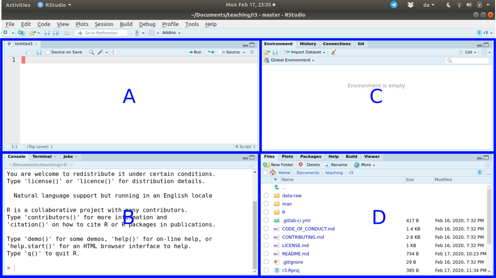

```{r}
#| label: setup
#| echo: false

library(ggplot2)
library(dplyr)
library(readr)
library(marginaleffects)


hd_data <- readr::read_csv(
  "https://raw.githubusercontent.com/DanMazJen/medicinsk-statistik/main/data/hd_data.csv"
)
hd_data <- hd_data |>
    mutate(
        ExAng = factor(ExAng,
            levels = c(0, 1),
            labels = c("no exercise-induced angesia", "yes, exercise-induced angesia")
        ),
        HD = factor(HD,
            levels = c("No", "Yes"),
            labels = c("no heart disease", "yes, heart disease")
        ),
        ChestPain = factor(ChestPain),
        Thal = factor(Thal),
        fasting_blood_glucose = factor(Fbs,
            levels = c(0, 1),
            labels = c("normal fasting blood glucose", "high fasting blood glucose")
        )
    )
```

<!--
### Editable in yaml
revealjs-plugins:
  - editable
filters:
  - editable
-->

# Conditional manetees {.smaller}

<!--
Image of planes and manetees...
-->



::: notes
Manetees in florida Abraham Wald WWII
:::

## Case 11: "Just send a quick summary" {.smaller .scrollable}

## Manetees and bombers

- *conditioning*: Dependence on state
- everything is conditional
  - on data
  - on model
- *Interaction*: Influence of predictor conditional on other predictor

## Coffee - sugar and sturring

TODO ...

## Heart rate decline as a function of age {.smaller}

```{r}
#| fig-cap: "Heart rate decline as a function of age."
#| label: fig-age-only

hd_data |>
  ggplot(ggplot2::aes(Age, MaxHR)) +
  geom_point() +
  geom_smooth(method = "lm")
```

$$
y_i = Normal(μ_i, σ)
$$

$$
μ_i = α + β_AAge_i
$$

## The value of age {.smaller}

- splitting the data is a bad idea
  - No estimates for the estimand: age \| HD
  - No value from pooling (σ and other uncertainty estimates)

```{r}
#| fig-cap: "Heart rate decline as a function of age."
#| label: fig-age-maxhr-separate

hd_data |>
  ggplot(ggplot2::aes(Age, MaxHR)) +
  facet_grid(cols = vars(HD)) +
  geom_point() +
  geom_smooth(method = "lm") +
  labs(title = "Conditioned on Heart Disease")
```

*So how about adding heart disease as a dummy variable?*

## Dummy doesn't work {.smaller}

```{r}
#| code-fold: true
#| scrollable: true
#| fig-cap: "Heart rate decline as a function of age and heart disease."
#| label: fig-age-and-hd

model_additive <-
    lm(MaxHR ~ Age + HD,
    data = hd_data)

plot_predictions(
    model_additive,
    condition = c("Age", "HD")
)
```

$$
y_i = Normal(μ_i, σ)
$$

$$
μ_i = α + β_AAge_i + β_HH_i
$$

*Only adjust intercept!*

- It adds a constant β_HH_i but the slope remains identical

## Interaction {auto-animate="true"}

Need to allow effect of age to dependt on heart disease status

$$
μ_i = α + β_AAge_i + β_HH_i
$$

Need to allow effect of age to dependt on heart disease status

## Interaction {auto-animate="true"}

$$
μ_i = α + γ_iA_i + β_HH_i
$$

$$
γ_i = β_A + β_{HA}H_i
$$

- old direct effect of Age
- linear effect of HD on slope

## Interaction {auto-animate="true"}

$$
μ_i = α + γ_iA_i + β_HH_i = α + β_A + β_{HA}A_iH_i + β_HH_i
$$

$$
γ_i = β_A + β_{HA}H_i
$$

- old direct effect of Age
- linear effect of HD on slope

*a linear model in a linear model*

## Adding an interaction

```{r}
#| code-fold: true
#| scrollable: true
#| fig-cap: "Heart rate decline as a function of age conditioned on heart disease."
#| label: fig-age-conditioned-on-hd

model_interact <-
    lm(MaxHR ~ Age + HD + Age:HD,
    data = hd_data)

plot_predictions(
    model_interact,
    condition = c("Age", "HD")
)
```

$$
y_i = Normal(μ_i, σ)
$$

$$
μ_i = α + β_AAge_i + β_HH_i + β_AAge_iβ_HH_i
$$

## Adding an interaction in R

```r

model_interact <-
    lm(MaxHR ~ Age + HD + Age:HD,
    data = hd_data)

same_model_interact <-
    lm(MaxHR ~ Age * HD, # expands to Age + HD + Age:HD
    data = hd_data)
```

## Interpreting interactions

*It's hard!*

- Add interaction -> other parameters change meaning
- Influence of predictor depens upon multiple parameters and their covariation

Go to the website exercises (num?)

## Exercises...

tmp

## Symmetry of interactions {.smaller}

Linear interactiosn are bidirectional

In the context of maxHR:

- if the effect of age depends on HD, then...
- effect of HD also depends upon age

::: {.fragment}
$$
μ_i = α + {\color{purple}{(β_A + β_AAge_iβ_HH_i)Age_i}} + β_HH_i
$$
:::

::: {.fragment}
$$
= α + β_AAge_i + β_AAge_iβ_HH_i + β_HH_i
$$
:::

::: {.fragment}
$$
= α + β_AAge_i + {\color{magenta}{(β_AAge_iβ_HH_i + β_H)H_i}}
$$
:::

## The effect of HD depends upon age {.smaller}

```{r}
#| fig-cap: "Heart rate as a function of age conditioned on heart disease."
#| label: fig-int-threenum

plot_predictions(
  model_interact,
  condition = list(
    "HD"  = unique, # Specific groups
    "Age" = c(30,60,90) #"threenum",    # Specific sequence
   )
  ) +
    facet_grid(cols=vars(Age))

#plot_predictions(
#  model_interact,
#  condition = list(
#    "HD",  # Specific groups
#       "Age" = "threenum"    # Specific sequence
#   )
#  )
```

Thought experiment: *Effect of getting HD*

- If I take a 30yo and give them HD, how will their maxHR change?

## Plotting the slope {.smaller}

```{r}
plot_slopes(model_interact, variables = "HD", condition = "Age") +
    geom_hline(yintercept = 0, linetype = "dotted") +
    labs(
        y = "expected difference (MaxHR | HD)"
    )
```

Thought experiment: *Effect of getting age*

- If I make a patient with HD younger/older , how will their maxHR change?

## Checking the estimates {.smaller}

```{r}
slopes(model_interact,
  variables = "HD",
  newdata = datagrid(Age = range))
```

*What does it say?*

## Hypothesis testing the interaction {.smaller}

```{r}
slopes(model_interact,
  variables = "HD",
  newdata = datagrid(Age = range),
  hypothesis = "b2 - b1 = 0"
)
```

Hypothesis-testing:

- Now testing whether this effect is different.

## Using {marginaleffects}

```r
model_interact <-
    lm(MaxHR ~ Age + HD + Age:HD,
    data = hd_data)

plot_predictions(
    model_interact,
    condition = c("Age", "HD")
)
```

## What if we have two continuous variables we allow to interact?

TODO: present data

## What if we have two continuous variables we allow to interact? {.smaller}

$$
μ_i = α + β_xx_i + β_zz_i + β_{xz}x_iz_i
$$

::: {.columns}
::::: {.column}
*Change in Y per unit change in x*

$$
\frac{\partial μ}{\partial x} = β_x + β_{xz}x
$$
:::::
::::: {.column}
*Change in Y per unit change in x*

$$
\frac{\partial μ}{\partial z} = β_z + β_{xz}z
$$
:::::
:::

## What if we have two continuous variables we allow to interact? {.smaller}

Meaning of parameters change when you add interaction:

- The coefficients are now non-linear
- coefficients in model without interaction:
  - change in outcome per unit change in predictor
  - e.g., when age increase 1 year, MaxHR increase 0.50 BPM
- Coefficients within interactions:
  - Change in outcome per unit change in predictor *when other predictor is
    zero*
  - e.g., change in MaxHR per unit change in age when HD is zero

## Interpreting continuous interaction

α: when x and z = 0

z: change in y per unit change z, when x = 0.

x: change in y per unit change x, when z = 0.

xz: interaction. Don't even try... Just plot!

## We can center the variables, but it's not enough: {.smaller}

::: {.columns}
::::: {.column}
output of summary of non-center
:::::
::::: {.column}
output of summary of center
:::::
:::

## Triptych plotting

explain

## Water on shade

```{r}
#| fig-cap: "BMI and glycemia, side by side."
#| fig-subcap:
#|   - "Distribution of BMI."
#|   - "Number of those with glycemia."
#| layout-nrows: 2

# without interaction
plot_predictions(
    model_interact,
    condition = c("Age", "HD")
)
# with interaction
plot_predictions(
    model_interact,
    condition = c("Age", "HD")
)
```

## Shade on water

```{r}
#| fig-cap: "BMI and glycemia, side by side."
#| fig-subcap:
#|   - "Distribution of BMI."
#|   - "Number of those with glycemia."
#| layout-nrows: 2

# without interaction
plot_predictions(
    model_interact,
    condition = c("Age", "HD")
)
# with interaction
plot_predictions(
    model_interact,
    condition = c("Age", "HD")
)
```

## Non-linear model from interaction only

Show example where at a certain point, the variable doesn't have an effect
anymore... E.g., when patient has too low functioning, therapy doesn't work
anymore!

## Interaction madness

3-way interaction ?

4-way interaction ?

10-way interaction ?

50-way interaction ?

## Example of interaction madness

Genetics x environment

We believe that genes are expressed conditional on lived experiences:

- Adverse Child Experiences (psychiatry)
- Exposure to toxins/viruses (nervous system)
- Availability to food (obesity)

## Intro to exercises:

Dataset....

## Intro to exercises:

Code exercises are...

Plots are all available at website

Interpretation exercises are...
