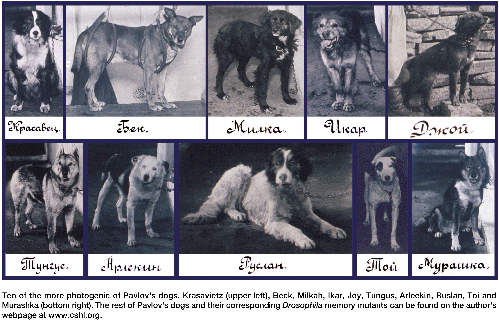

# Bending the rules {.smaller}

```{r}
#| label: setup
#| echo: false

library(ggplot2)
library(dplyr)
library(readr)
library(marginaleffects)
library(tidyr)

data(hd_data, package = "medisr")

hd_data <- hd_data |>
    mutate(
        ExAng = factor(ExAng,
            levels = c(0, 1),
            labels = c("no exercise-induced angesia", "yes, exercise-induced angesia")
        ),
        HD = factor(HD,
            levels = c("No", "Yes"),
            labels = c("no heart disease", "yes, heart disease")
        ),
        ChestPain = factor(ChestPain),
        Thal = factor(Thal),
        fasting_blood_glucose = factor(Fbs,
            levels = c(0, 1),
            labels = c("normal fasting blood glucose", "high fasting blood glucose")
        )
    )
```

<!--
### Editable in yaml
revealjs-plugins:
  - editable
filters:
  - editable
-->

## Conditional saliva {.center .align-center}

{fig-align="center"}

## Case 11: Conditioned on age {.smaller .scrollable}

At AalboR Statistical Hospital, clinicians have been reviewing data from
patients who underwent exercise testing as part of their cardiac evaluation.

One of the variables recorded during the test is maximum heart rate. When
looking at the data as a whole, the clinicians notice an interesting pattern:
patients with heart disease tend to have lower maximum heart rates than patients
without heart disease.

At first, this seems fairly straightforward.

During a case discussion, however, a cardiologist points out something that
makes the pattern less convincing:

> "Before we interpret this relationship, we should remember that maximum heart
> rate also changes with age. A maximum heart rate that seems unusually low for
> a younger patient may not be unusual for an older patient."

This prompts the team to look more closely at the data.

They begin comparing patients of different ages and notice that the relationship
between maximum heart rate and heart disease does not look quite the same
everywhere in the dataset.

What initially appeared to be a simple relationship may depend on who the
patient is.

You are asked to investigate this pattern in the hospital's patient data. The
challenge is to understand what happens to the relationship between maximum
heart rate and heart disease when we consider patients conditional on their age ---
and whether the relationship itself changes across ages.

The findings may reveal something that is easy to miss when looking only at the
overall data.

## Case supplemental material {.smaller}

```{r}
#| label: case-supplement
#| echo: false
#| warning: false
#| layout-ncol: 2
#| fig-cap: "AalboR Statistical Hospital internal review data at the meeting"
#| fig-subcap:
#|   - "Boxplot showing decreased max heart rate for heart disease patients"
#|   - "Scatter plot supporting the cardiologist's statement"
#|   - "Follow-up data visualization based on the cardiologist's statement"

hd_data |>
  ggplot(ggplot2::aes(HD, MaxHR)) +
  geom_boxplot()

hd_data |>
  ggplot(ggplot2::aes(Age, MaxHR)) +
  geom_point()

hd_data |>
  ggplot(ggplot2::aes(Age, MaxHR, color=HD)) +
  geom_point()+
  geom_smooth()
```

## Deadly asbestos - according to whom? {.center .align-center}

{fig-align="center"}

::: {.fragment}
Read section 13.4
:::

::: notes
Is it the synergy of two damaging effects? Or because non-smokers are faster to
spot lung anomalies?
:::

## Conditional bells or cigarrts {.center .align-center}

- *conditioning*: Dependence on state
- everything is conditional
  - on data
  - on model
- *Interaction*: Influence of predictor conditional on other predictor

## Conditional modulation or interaction {.center .align-center}

::: {.r-fit-text}
When variable $z$ changes the effect of $x$ on outcome $y$
:::

Do you have examples in your life?

Talk to your neighbor!

## The additive assumption and linear assumption of regression {.smaller}

::: {.r-fit-text}
**Reading task 13.5**
:::

The additivity assumption

- the association between a predictor $X_j$ and the response Y does linear not
  depend on the values of the other predictors.

The linearity assumption

- the change in the response Y associated with a one-unit change in $X_j$ is
  constant, regardless of the value of $X_j$.

## Making a regression model {.smaller}

`Age` is continuous: 0 --- 125

`Heart disease` is binomial: {0,1} --- yes or no.

$$
  MaxHR_i = α + β_1Age_i
$$

*Now, what do we do with `HD`?*

## One question, two models... {.smaller}

We could split the data in two:

> Those that have heart disease and everyone else...

```{r}
#| fig-cap: "Heart rate decline as a function of age."
#| label: fig-age-maxhr-separate
#| fig-subcap:
#|   - "Regression fit for each group"

hd_data |>
  ggplot(ggplot2::aes(Age, MaxHR)) +
  facet_grid(cols = vars(HD)) +
  geom_point() +
  geom_smooth(method = "lm") +
  labs(title = "Conditioned on Heart Disease")
```

## ... but no answer {.smaller}

```{r}
#| label: coef-no-pool

lm(MaxHR ~ Age, data = subset(hd_data,HD=="yes, heart disease"))
lm(MaxHR ~ Age, data = subset(hd_data,HD=="no heart disease"))
```

::: {.fragment}
> No estimates for the estimand: MaxHR ~ HD \| Age

In words, is the effect of heart disease on max heart rate mediated by age?

> No value from pooling (σ and other uncertainty estimates)
:::

## Let's try something else! {.center .align-center}

::: {.r-fit-text}
*Any ideas?*
:::

## Adding the variable to a regression model is not enough {.smaller}

$$
  MaxHR_i = Normal(μ_i, σ)
$$

$$
  μ_i = α + β_1Age_i + β_2HD_i
$$

*Only adjust intercept!*

- It adds a constant $β_1HD_i$ but the slope remains identical...

##

```{r}
#| label: addition-not-enough
#| code-line-numbers: true
#| output-location: slide
#| echo: true
#| output: false

hd_data <- medisr::hd_data # <1>

model_additive <-         # <2>
    lm(MaxHR ~ Age + HD,   # <2>
    data = hd_data)       # <2>

library(marginaleffects)  # <3>

plot_predictions(       # <4>
    model_additive,      # <4>
    condition = c("Age", "HD") # <4>
)
```

1. First, we load in the dataset.
2. Next, we make a simple linear model adding the two variables of interest.
3. Here, we load the `{marginaleffects}` package
4. We plot how the model predicts the max heart rate based on age for both
   patients with and without heart disease. Note how we add the model variable
   and give a string vector to the argument `condition`.

##

```{r}
#| label: addition-not-enough2
#| output-location: slide
#| echo: false
#| output: True

plot_predictions(       # <4>
    model_additive,      # <4>
    condition = c("Age", "HD") # <4>
)
```

## We know they should not be parallel {.smaller}

```{r}
#| fig-cap: ""
#| label: fig-age-maxhr-separate2
#| fig-subcap:
#|   - "Subset models"
#|   - Raw data
#| layout-ncol: 2

hd_data |>
  ggplot(ggplot2::aes(Age, MaxHR)) +
  facet_grid(cols = vars(HD)) +
  geom_point() +
  geom_smooth(method = "lm") +
  labs(title = "Conditioned on Heart Disease")

hd_data |>
  ggplot(ggplot2::aes(Age, MaxHR, color=HD)) +
  geom_point()+
  geom_smooth()
```

## Reading task: Making non-additive terms in linear models {.center .align-center}

**Read section 13.8: Making non-additive terms in linear models**

## Conditional multiplication {.center .align-center}

Consider the cancer risk explained by asbestos exposure (h) conditioned on
smoking status (or pack-year).

<!-- panache-ignore-start-->
  | Asbestos exposure (h) ($X_1$) | smoking status ($X_2$) | Interaction effect ($X_1X_2$) |
  | -------------------: | ---------------------: | ---------: |
  |                    2 |                yes = 1 |          2 |
  |                    3 |                yes = 1 |          3 |
  |                    2 |                 no = 3 |          6 |
  |                    3 |                 no = 3 |          9 |
<!-- panache-ignore-end-->

## Conditional effects = Interaction effects {.center .align-center}

> Additive models: Where the effect of one predictor does not depend on the
> other predictor.

> Interaction models: Where the effect of one predictor can depend on the other
> predictor.

## Adding an interaction - the equation

$$
  y_i = Normal(μ_i, σ)
$$

$$
  μ_i = α + β_1Age_i + β_2HD_i + {\color{purple}{β_3Age_iHD_i}}
$$

## Adding an interaction - in R

```{r}
#| code-fold: true
#| scrollable: true
#| fig-cap: "Heart rate decline as a function of age conditioned on heart disease."
#| label: fig-age-conditioned-on-hd

model_interact <-
    lm(MaxHR ~ Age + HD + Age:HD,
    data = hd_data)

plot_predictions(
    model_interact,
    condition = c("Age", "HD")
) +
    ylab("Predicted max heart rate")
```

## Adding an interaction in R

```r
model_interact <-
    lm(MaxHR ~ Age + HD + Age:HD,
    data = hd_data)

same_model_interact <-
    lm(MaxHR ~ Age * HD, # expands to Age + HD + Age:HD
    data = hd_data)
```

## Getting our estimand

```{r}
#| label: get-coef

coef(model_interact)
```

> Finally, we have a coefficient for the interaction effect!

{.r-stretch}

## Interpreting interactions

{.r-stretch}

- Add interaction -> other parameters change meaning
- Influence of predictor depens upon multiple parameters and their covariation

## Experience interpreting interactions

Read the sections

- *"13.10 Interpreting an interaction estimate"*

It's a bit long...

## Interpreting interactions together {.r-stretch}

Let's try it together:

We model quality of life.

Sick = {0,1} no/yes Age = continuous

We get:

  | Coefficient | Value |
  | ----------- | ----: |
  | Intercept   |    10 |
  | Age         |     2 |
  | Sick        |   -20 |
  | Age × Sick  |    -1 |

- *What is the regression coefficient?*
- *What is the intercept representing?*
- *What is `Sick` representing?*

::: {.notes}
- $y_i = 10 + Age2 + sick - 20 + ageBySick - 1$
- Quality of life is 10 for non-sick individuals at age == 0
- Quality of life is -10 for sick individuals at age == 0
:::

## Interpreting interactions together

Here's the regression equation:

$$
  \bar{Y} = 10 + 2 * age - 20 * sick - 1 * (age × sick)
$$

- *What if I'm 32 years old and not sick?*
- *What if I'm 24 years old and sick?*

## Symmetry of interactions {.smaller}

Which of the following questions have we been modeling until now:

> How much does the influence of age (on max heart rate) depend on whether the
> patient has a heart disease?

or

> How much does the influence of having a heart disease (on max heart rate)
> depend on age?

## Reading task

section 13.11 Symmetry of the linear interaction

## If the effect of HD depends on age {.smaller}

```{r}
#| fig-cap: "Heart rate as a function of age conditioned on heart disease."
#| label: fig-int-threenum

plot_predictions(
  model_interact,
  condition = list(
    "HD"  = unique, # Specific groups
    "Age" = c(30,60,90) #"threenum",    # Specific sequence
   )
  ) +
    facet_grid(cols=vars(Age))

#plot_predictions(
#  model_interact,
#  condition = list(
#    "HD",  # Specific groups
#       "Age" = "threenum"    # Specific sequence
#   )
#  )
```

Thought experiment: *Effect of getting HD*

- If I give people a HD, how will their maxHR change depending on their age?

## Plotting the slope {.smaller}

```{r}
#| label: counterfactual-slope

plot_slopes(model_interact, variables = "HD", condition = "Age") +
    geom_hline(yintercept = 0, linetype = "dotted") +
    labs(
        y = "expected difference (MaxHR | HD)"
    )
```

Thought experiment: *Effect of getting age*

- If I make patients younger/older, how will having HD affect their maxHR
  change?

## What if we have two continuous variables we allow to interact? {.center .align-center}

{fig-align="center"}

## What if we have two continuous variables we allow to interact? {.center .align-center}

- `MaxHR`
- `Chol`
- `Age`

## What if we have two continuous variables we allow to interact? {.smaller}

$$
  μ_i = α + β_xx_i + β_zz_i + β_{xz}x_iz_i
$$

::: {.columns}
::::: {.column}
*Change in Y per unit change in x*

$$
  \frac{\partial μ}{\partial x} = β_x + β_{xz}x
$$
:::::
::::: {.column}
*Change in Y per unit change in x*

$$
  \frac{\partial μ}{\partial z} = β_z + β_{xz}z
$$
:::::
:::

## What if we have two continuous variables we allow to interact? {.smaller}

Meaning of parameters change when you add interaction:

- The coefficients are now non-linear
- coefficients in model without interaction:
  - change in outcome per unit change in predictor
  - e.g., when age increase 1 year, MaxHR increase 0.50 BPM
- Coefficients within interactions:
  - Change in outcome per unit change in predictor *when other predictor is
    zero*
  - e.g., change in MaxHR per unit change in age when HD is zero

## Interpreting continuous interaction

α: when x and z = 0

z: change in y per unit change z, when x = 0.

x: change in y per unit change x, when z = 0.

xz: interaction. Don't even try... Just plot!

## Pain relief as an example

```{r}
#| label: coef-pain-model

lm(MaxHR ~ Age + Chol + Age:Chol, data=hd_data)
```

Unlike the `HD` condition `{yes/no}`, both `Chol` and `Age` have infinite
values!

::: {.r-fit-text}
How to we plot that? 👀
:::

## Triptych plotting

{#triptic-art fig-alt="Raising of the Cross, Rubens, 1610–11, Antwerp Cathedral"}

> *A triptych (/ˈtrɪptɪk/ TRIP-tik) is a work of art (usually a panel painting)
> that is divided into three sections, or three carved panels that are hinged
> together and can be folded shut or displayed open.*

- [Wikipedia](https://en.wikipedia.org/wiki/Triptych)

##

```{r}
#| label: trip1

# Calculate Age values at -2 SD, Mean, and +2 SD
age_values <- c(
  "-1 SD" = mean(hd_data$Age, na.rm = TRUE) - (sd(hd_data$Age, na.rm = TRUE) * 1),
  "Mean"  = mean(hd_data$Age, na.rm = TRUE),
  "+1 SD" = mean(hd_data$Age, na.rm = TRUE) + (sd(hd_data$Age, na.rm = TRUE) * 1)
)

# Create prediction data
plot_data <- expand_grid(
  Chol = seq(
    min(hd_data$Chol, na.rm = TRUE),
    max(hd_data$Chol, na.rm = TRUE),
    length.out = 100
  ),
  age_group = names(age_values)
) |>
  mutate(
    Age = age_values[age_group],
    age_group = factor(
      age_group,
      levels = c("-1 SD", "Mean", "+1 SD")
    )
  )

# Fit model
model <- lm(MaxHR ~ Age * Chol, data = hd_data)

# Add predicted MaxHR
plot_data <- plot_data |>
  mutate(
    predicted_MaxHR = predict(model, newdata = plot_data)
  )

# Plot
ggplot(plot_data, aes(x = Chol, y = predicted_MaxHR)) +
  geom_line(linewidth = 1) +
  facet_wrap(
    ~ age_group,
    labeller = as_labeller(
      c(
        "-1 SD" = "-1 SD of Age",
        "Mean"  = "Mean Age",
        "+1 SD" = "+1 SD of Age"
      )
    )
  ) +
  labs(
    x = "Chol",
    y = "Maximum heart rate (MaxHR)",
    title = "Predicted Maximum Heart Rate by Chol",
    subtitle = "At −1 SD, Mean, and +1 SD of Age"
  ) +
  theme_minimal()

```

##

```{r}
#| label: triptic-plot2
#| fig-cap: Max heart rate exampled by age conditioned on cholesterole

# Calculate Chol values at -1 SD, Mean, and +1 SD
chol_values <- c(
  "-2 SD" = mean(hd_data$Chol, na.rm = TRUE) - (sd(hd_data$Chol, na.rm = TRUE) *2),
  "Mean"  = mean(hd_data$Chol, na.rm = TRUE),
  "+2 SD" = mean(hd_data$Chol, na.rm = TRUE) + (sd(hd_data$Chol, na.rm = TRUE)*2)
)

# Create prediction data
plot_data <- expand_grid(
  Age = seq(
    min(hd_data$Age, na.rm = TRUE),
    max(hd_data$Age, na.rm = TRUE),
    length.out = 100
  ),
  chol_group = names(chol_values)
) |>
  mutate(
    Chol = chol_values[chol_group],
    chol_group = factor(
      chol_group,
      levels = c("-2 SD", "Mean", "+2 SD")
    )
  )

# Fit model
model <- lm(MaxHR ~ Age * Chol, data = hd_data)

# Add predicted MaxHR
plot_data <- plot_data |>
  mutate(
    predicted_MaxHR = predict(model, newdata = plot_data)
  )

# Plot
ggplot(plot_data, aes(x = Age, y = predicted_MaxHR)) +
  geom_line(linewidth = 1) +
  facet_wrap(
  ~ chol_group,
  labeller = as_labeller(
    c(
        "-2 SD" = "-2 SD of Chol",
        "Mean"  = "Mean Chol",
        "+2 SD" = "+2 SD of Chol"
        )
        )
    ) +
  labs(
    x = "Age",
    y = "Maximum heart rate (MaxHR)",
    title = "Predicted Maximum Heart Rate by Age",
    subtitle = "At −2 SD, Mean, and +2 SD of Chol"
  ) +
  theme_minimal()
```

## Questions about interaction?

Otherwise, we'll shift gears a bit....

## Polynomials - bending the rules, literally!

Remember the linearity assumption?

**Question:**

- Imagine two variables that don't have a linear relationship

## Human height is not linear! Is regression broken?

```{r}
#| label: height
#| fig-cap: "Demographic data from Kalahari !Kung San people collected by Nancy Howell "
#| echo: false

height_data <- medisr::height_data

height_data |>
    ggplot(aes(age,height)) +
    geom_point()
```

## Polynomials - bending the rules, literally!

Can we use interaction?

::: {.fragment}
Well, sort of --- In this case, the variable is interacting with itself!
:::

## Polynomial madness

  | Polynomial degree | Regression model                                                    |
  | ----------------: | ------------------------------------------------------------------- |
  |                 1 | $y = \beta_0 + \beta_1 x$                                           |
  |                 2 | $y = \beta_0 + \beta_1 x + \beta_2 x^2$                             |
  |                 3 | $y = \beta_0 + \beta_1 x + \beta_2 x^2 + \beta_3 x^3$               |
  |                 4 | $y = \beta_0 + \beta_1 x + \beta_2 x^2 + \beta_3 x^3 + \beta_4 x^4$ |

## Polynomial madness {.r-stretch}

> Live demo:

`shiny::runApp("apps/polynomial-app/app.R")`

## Discussion of polynomial regression

Think for yourself for 3 minutes:

- Which model is the best?
- What makes some models better or worse?
- Would you trust predictions from these models? Which would you (not)?

Talk to your neiggbour and try to come to agreement.

## Interaction madness {.r-stretch}

Imagine we wanted to predict heart disease.

logit(p) = `HD`

We could use the variables:

- `Chol` Cholesterole
- `RestBP` resting blood pressure
- `MaxHR`
- `ChestPain` type of chest pain (if present)

```r
#| echo: true
#| code-fold: true

five_way_model <- glm(
    as.factor(HD) ~ Chol * RestBP * MaxHR * ChestPain,
    family = binomial,
    data=hd_data
    )
```

## Interaction madness {.scrollabe}

```{r}
#| label: five-way-model
#| fig-cap: "That's a lot of coefficients! 👀"

five_way_model <- glm(
    as.factor(HD) ~ Chol * RestBP * MaxHR * ChestPain,
    family = binomial,
    data=hd_data
    )

parameters::parameters(five_way_model)[,c(1,2)] |> print(n=Inf)
```

## Interaction madness {.center .smaller}

Oh my, that's a lot of coefficients! 👀

How in the world are we ever going to interpret this monster?! And now it's a
logistic regression, so the coefficients are in log-odds! 😅

Truth is --- we can't infer much (if anything at all) from the coefficients
alone. We would need to do a marginal effect estimate, which we'll cover in
@sec-marginal-effects.

## Example of interaction madness

Genetics x environment

We believe that genes are expressed conditional on lived experiences:

- Adverse Child Experiences (psychiatry)
- Exposure to toxins/viruses (nervous system)
- Availability to food (obesity)

These could be 50-way or 1000-way interactions!

## Exercises:

Go to the website


<!--


::: {.hidden}
At AalboR Statistical Hospital, a new exercise-based cardiac assessment protocol
has recently been proposed by some researchers as a screening tool for heart
disease, suggesting that patients with lower max heart rate are more likely to
have underlying heart disease. Based on this, some clinicians have started using
the max heart rate during exercise as a quick indicator when scrrening patients.

However, during a recent internal meeting, a cardiologist raises a concern:

"I'm not convinced this applies to all patients. Especially older patients ---
their max heart rate is already very low. If that's true, we could be biasing
our screening in our older patients. You are asked to explore the hospital's
patient data to assess whether the relationship between heart disease and max
heart rate appears consistent across patients, or whether it differs depending
on their age.

You are tasked with the decision: Should this new assessment approach be used
broadly, or are there patient groups where it may be misleading?
:::


::: {.hidden}
Oscar winners live longer


::::: {.fragment}
Why is that - any clues? 👀
:::::

::::: notes
Survivorship Bias and Immortal Time Bias

A useful example of survivorship bias comes from research on Academy
Award--winning actors and actresses. An original study reported that Oscar
winners lived almost four years longer than actors who did not win. However, a
later reanalysis showed that the statistical method gave winners an unfair
advantage.

The key problem was immortal time bias. Actors were classified as "winners"
based on whether they eventually won an Oscar, and their years of life before
winning were counted as part of their survival after winning. But to become a
winner, an actor first had to survive long enough to receive the award. These
years were therefore "immortal" with respect to membership in the winner group:
the person had to be alive to become a winner.

For example, some actors who never won had already died before other actors in
the winner group had even received their Oscars. Comparing these groups from the
beginning therefore made the winners appear to have survived longer, even if
winning an Oscar had no effect on longevity.

When the data were reanalyzed using methods that correctly accounted for the
timing of the award, the apparent survival advantage fell to about one year and
was no longer statistically significant.

Clinical lesson: When interpreting observational studies, always ask: When did
exposure or group membership actually begin? If people must survive long enough
to enter an "exposed" group, counting their earlier survival time can create a
misleading treatment or exposure effect.

Take-home message: Association does not necessarily mean causation---and in
survival analysis, the timing of exposure matters.
:::::
:::

::: {.hidden}
## Checking the estimates {.smaller}

```{r}
slopes(model_interact,
  variables = "HD",
  newdata = datagrid(Age = range))
```

*What does it say?*

## Hypothesis testing the interaction {.smaller}

```{r}
slopes(model_interact,
  variables = "HD",
  newdata = datagrid(Age = range),
  hypothesis = "b2 - b1 = 0"
)
```

Hypothesis-testing:

- Now testing whether this effect is different.

## Using {marginaleffects}

```r
model_interact <-
    lm(MaxHR ~ Age + HD + Age:HD,
    data = hd_data)

plot_predictions(
    model_interact,
    condition = c("Age", "HD")
)
```
:::


::: {.hidden}
## What about logistic regression?

To determine what the interaction means for your outcome, evaluate the
interaction coefficient's mathematical sign:

- Positive Interaction (β₃ > 0):
  - The combined effect of both variables is greater than the sum of their
    individual effects. In terms of odds, the effect of $X_1$ is amplified as
    $X_2$ increases.
- Negative Interaction (β₃ < 0):
  - The combined effect is less than the sum of their individual effects. The
    effect of $X_1$ is dampened or diminishes as $X_2$ increases.

## What about logistic regression?

Differing Interpretations

- *Log-Odds Scale:* An interaction term here assesses whether the multiplicative
  effect of the odds of an outcome changes based on another variable
- *Probability Scale:* An interaction term here assesses whether the combined
  effect of two variables is greater or smaller than the sum of their individual
  effects.
:::

## We can center the variables, but it's not enough: {.smaller}

::: {.columns}
::::: {.column}
output of summary of non-center
:::::
::::: {.column}
output of summary of center
:::::
:::

```{r}
#| label: present-data

pain_data |>
    head()

m <- lm(relief ~ dose * pain, data = pain_data)

summary(m)
```


::: {.hidden}
## Interaction {auto-animate="true"}

Need to allow effect of age to dependt on heart disease status

$$
  μ_i = α + β_AAge_i + β_1HD_i
$$

Need to allow effect of age to dependt on heart disease status

## Interaction {auto-animate="true"}

$$
  μ_i = α + γ_iAge_i + β_1HD_i
$$

$$
  γ_i = β_{Age} + β_{HDAge}HD_i
$$

- old direct effect of Age
- linear effect of HD on slope

## Interaction {auto-animate="true"}

$$
  μ_i = α + γ_iAge_i + β_1HD_i = α + β_A + β_{HA}A_iH_i + β_HH_i
$$

$$
  MaxHR_i = β_A + β_{HDAge}HD_i
$$

- old direct effect of Age
- linear effect of HD on slope

*a linear model in a linear model*
:::


$$
  \text{max heart rate}_i \sim α + β_1age + β_2HD + β_3age\_by\_HD + ε\\
$$

This is our regression equation

##

::: {.fragment}
$$
  μ_i = α + {\color{purple}{(β_A + β_AAge_iβ_HH_i)Age_i}} + β_HH_i
$$
:::

::: {.fragment}
$$
  = α + β_AAge_i + β_AAge_iβ_HH_i + β_HH_i
$$
:::

::: {.fragment}
$$
  = α + β_AAge_i + {\color{magenta}{(β_AAge_iβ_HH_i + β_H)H_i}}
$$
:::


```{r}
#| label: cont-interaction
#| echo: false

#pain_data <- expand_grid(
#  dose = 0:10,
#  pain = c(0,1,2)
#) |>
#  mutate(
#    relief = 1.6 + 0.4*dose + 0.4*pain + 0.9*dose*pain + rnorm(n(), 0,1)
#    )

pain_data <- expand_grid(
  dose = seq(0, 10, length.out = 50),
  pain = seq(0, 2, length.out = 50)
) |>
  mutate(
    dose_c = dose - mean(dose),
    pain_c = pain - mean(pain),
    relief = 1.6 +
             0.4*dose_c +
             0.4*pain_c +
             0.9*dose_c*pain_c +
             rnorm(n(), 0, 1)
  )
```


#If you also want the actual data points
#You can combine the original observations with the predicted lines. That will give you much more data visually, while the lines show the relationship at the three specified Chol levels.

ggplot() +
  geom_point(
    data = hd_data,
    aes(x = Age, y = MaxHR),
    alpha = 0.4
  ) +
  geom_line(
    data = plot_data,
    aes(x = Age, y = predicted_MaxHR),
    linewidth = 1
  ) +
  facet_wrap(~ chol_group) +
  labs(
    x = "Age",
    y = "Maximum heart rate (MaxHR)",
    title = "Maximum Heart Rate by Age",
    subtitle = "Predicted relationship at −1 SD, Mean, and +1 SD of Chol"
  ) +
  theme_minimal()

#pain_data |>
#  mutate(
#    pain_group = factor(
#      pain,
#      labels = c("No pain", "Mild pain", "Severe pain")
#    ),
#    dose_group = cut(
#      dose,
#      breaks = c(-Inf, 3, 6, Inf),
#      labels = c("Dose < 3mg", "Dose 3–6 mg", "Dose > 6mg")
#    )
#  ) |>
#  ggplot(aes(pain, relief)) +
#  geom_point() +
#  geom_smooth(method = "lm", se = FALSE) +
#  facet_grid(~ dose_group) +
#  labs(
#    x = "Pain groups",
#    y = "Subjective relief (0–25)"
#  ) +
#  theme_minimal() +
#  scale_x_continuous(
#    breaks = c(0, 1, 2),
#    labels = c("No pain", "Mild pain", "Severe pain")
#  )


-->
