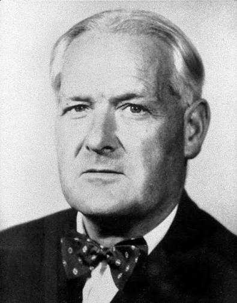

# A fishy counting trick {.smaller}

```{r}
#| label: setup
#| echo: false

library(ggplot2)
library(MASS)
library(readr)
library(tidyr)
library(broom)
library(marginaleffects)
library(patchwork)
library(performance)
library(dplyr)

#hd_data <- readr::read_csv(
#  "https://raw.githubusercontent.com/DanMazJen/medicinsk-statistik/main/data/hd_data.csv"
#)

data(epil)

epil <- epil |>
    rename(
        seizure_count = y,
        drug = trt,
        baseline_seizures = base,
        trial_end = V4,
        log_base = lbase,
        log_age = lage
  ) |>
    #filter(period < 2 | period > 3) |>
    filter(period > 3) |>
    mutate(
        seizure_count = as.integer(seizure_count),
        period = factor(period,
            levels = c(4),
            labels = c("week_8")
            )
)

# https://arelbundock.com/posts/quarto_figures/
knitr::opts_chunk$set(
    out.width = "70%", # enough room to breath
    fig.width = 6,     # reasonable size
    fig.asp = 0.618,   # golden ratio
    fig.align = "center" # mostly what I want
)
```

<!--
### Editable in yaml
revealjs-plugins:
  - editable
filters:
  - editable
-->

##

{.r-stretch fig-align="center"}

## Case Session 12: "Why are seizure data always right-skewed?" {.smaller .scrollable}

At PhaRmacy Inc., excitement is growing over a new anti-seizure medication,
progabide. A randomized clinical trial has just finished, and the lead
investigator walks into the weekly research meeting with a smile and says:

> "The treatment group had fewer seizures."

Everyone celebrates but one brave person leans forward and asks:

> "Fewer... according to what model?"

The lead investigator acknowledges the questions and provides the available
data.

Looking at the raw data raises more questions than answers. The outcome is the
number of seizures each patient experienced during the study. Some patients had
only a handful of seizures, while others had dozens, and a few appear very
different from the rest. The distribution is highly skewed and doesn't resemble
the continuous, normally distributed outcomes you're used to analyzing. At the
same time, the outcome is clearly not binary, so a logistic regression model
would not be appropriate either.

As a member of the clinical development team, you have been asked to review the
trial results before they are presented to management. Your role is to work with
the biostatistics group to ensure that the data are analyzed using an
appropriate model and that the conclusions about progabide's effectiveness are
scientifically sound.

At the upcoming project meeting, you'll need to explain why some familiar
regression models are not suitable for these data, recommend a more appropriate
approach, and interpret what the analysis tells the team about the effect of
progabide after accounting for patients' baseline seizure frequency.

## Discuss the causal mechanisms of progabide

- Discuss how progabide might work and how baseline seizure frequency might tie
  into this.
- You may look at the wikipidia page for progabide, but don't overcomplicate
  your scientific model.

Take 5 minutes for this.

## My proposed scientifric model

```{r}
#| label: dag
#| echo: false
#| warning: false

dag <- dagitty::dagitty("dag { severity -> GABA; severity -> preSeizures; GABA -> postSeizures; GABA -> preSeizures; preSeizures -> postSeizures; drug -> GABA }")
dag |> ggdag::tidy_dagitty() |> ggdag::ggdag(text = FALSE) + ggdag::geom_dag_text(size = 2.5) + theme_void()
```

## The dataset {.smaller}

- `MASS::epil`: 59 patients

You read about the data for today. We clean the data as such:

**Variables**:

- `seizure_count`
- `drug`
- `baseline_seizures`
- `subject`
- `age`

##

::: {.r-stretch-text}
What would we like to check before making a model?
:::

## The dataset {.r-stretch}

```{r}
#| label: explore-arms

epil |>
    count(drug)
```

## Exploratory visualization

```{r}
#| label: explore1
#| layout-ncol: 2
#| layout-align: center

# cap-location: bottom

seizure_lims <- range(c(epil$baseline_seizures, epil$seizure_count))

baseline_data_plot <- epil |>
    ggplot() +
    geom_histogram(aes(x=baseline_seizures), bins=30) +
    coord_cartesian(xlim = seizure_lims)

posttrial_data_plot <- epil |>
    ggplot() +
    geom_histogram(aes(x=seizure_count), bins=30) +
    coord_cartesian(xlim = seizure_lims)

baseline_data_plot + posttrial_data_plot

epil |>
    ggplot(aes(baseline_seizures, seizure_count,color=drug)) +
    geom_point(alpha=0.6) +
    geom_smooth() +
    theme_bw()
```

::: {.notes}
**Observation**: Strong association between `baseline_seizures` and
`seizure_count`.
:::

##

Quickly run through section **14.4.2 Exploring the data for familiarization**

{.r-stretch fig-align="center"}

## Can We Use Logistic Regression?
::: {.fragment}
**Recap**:

Logistic regression models probabilities using the binomial distribution:

$$
  outcome \sim Binomial(N, p)
$$
**Limitations**:

- Requires known trial count (N).
- Only two outcome types.
- Uses the logit link to transform the outcome variable.
:::

## Reading Task: When the Odds Are Low, Go Poisson! {.smaller .scrollable}

::: {.fragment}
**Poisson regression**:

- When *N* (trial count) is unknown (e.g., mortality rate).
- When the prevalence is low
:::

::: {.fragment}
**Mathematical intuition**:

Binomial:

$Mean = Np$ and $Variance = Np(1 - p)$.

When N is large and p is small, $mean ≈ variance ≈ Np$ --- we call this λ
(lambda).
:::

## Log Link

::: {.columns}
::::: {.column width="30%"}
Ensures positive predictions (counts cannot be negative).

$$
  y_i \sim Poisson(λ_i) \\
  log(λ_i) = α + βx_i
$$
:::::
::::: {.column width="70%"}
```{r}
#| label: why-log
#| echo: false

dat <- data.frame(x = seq(-5, 5, length.out = 200)) |>
  mutate(
    log_mu = -1 + 0.5*x,
    mu = exp(log_mu)
  ) |>
  pivot_longer(cols = c(log_mu, mu), names_to = "scale", values_to = "value") |>
  mutate(scale = recode(scale, log_mu = "Log-linear (Poisson) scale:\nlog(E(Y))", mu = "Outcome scale:\nE(Y)"))

ggplot(dat, aes(x = x, y = value)) +
  geom_line(linewidth = 1.3, color = "#2166AC") +
  geom_hline(yintercept = 0, linetype = "dashed", color = "grey40") +
  facet_wrap(~scale, scales = "free_y") +
  theme_minimal(base_size = 14) +
  labs(title = "Why Use a Log Link in Poisson Regression?", subtitle = "Negative values are allowed on the log scale, but exponentiation guarantees positive counts", x = "Predictor (x)", y = "Outcome (y)")
```
:::::
:::

## Discussion Task: Gaussian vs. Poisson for Seizure Counts

::: {.r-fit-text}
Read section 14.7
:::

**Questions**:

What do you notice? Compare the plots to the exploratory data visualization
earlier (see website).

- Which best captures the data?
- Which makes the worst fit?
- What else do you notice?

## Proposing a model

::: {.fragment}
**Model Formulation**:

$$
  seizure\_count_i \sim Poisson(λ_i) \\
  log(λ_i) = α + β_1 baseline\_seizures + β_2 drug
$$
:::

::: {.fragment}
**Interpretation:**

- `seizure_count` is Poisson-distributed.
- Log link function.
- Intercept (α), estimand $β_{drug}$ and conditioned on (`baseline_seizures`).
:::

## Fitting the model {.smaller}

{.r-stretch fig-align="center"}

Best practice:

- Always fit the simplest model first.
- Use this model as a sanity check
- When you understand it, go ahead and build on it
- At some point, you'll have the correct scientific model, which you can use for
  inference

## Intercept and drug model {.center .align-center}

Go ahead and try to fit the model:

```r
m1_drug <- glm(seizure_count ~ drug,  # <1>
    family = "what should go here?",       # <2>
    data = epil)                    # <3>

    parameters::parameters(m1_drug) # <4>
```

1. `glm()` function modeling `seizure_count` as a function of `drug`
2. `fimaly` is Poisson distribution with log link
3. data is the `epil` `data.frame`
4. to extract the parameters

## Intercept and drug model {.center .align-center}

```r
m1_drug <- glm(seizure_count ~ drug,  # <1>
    family = poisson(link="log"),       # <2>
    data = epil)                    # <3>

    parameters::parameters(m1_drug) # <4>
```

1. `glm()` function modeling `seizure_count` as a function of `drug`
2. `fimaly` is Poisson distribution with log link
3. data is the `epil` `data.frame`
4. to extract the parameters

## Intercept and drug model {.center .align-center}
::: {.fragment}
```{r}
#| label: intercept-only-fit
#| code-fold: show

m1_drug <- glm(seizure_count ~ drug,
    family = poisson(link="log"),
    data = epil)

    parameters::parameters(m1_drug)
```
:::

## {.center .align-center}

::: {.r-fit-text}
What does this mean!? 👀
:::

## GLMs Are Notoriously Difficult to Interpret

{fig-align="center"}

##

These are the coefficients:

`coef(m1_drug)`

```{r}
#| label: try-read-coef

coef(m1_drug)
```

{fig-align="center"}

## Which space?

::: {.r-fit-text}
The regression coefficients are in log-space
:::

```{r}
#| label: try-read-coef2

coef(m1_drug)
```

We need to transform back to outcome space!

## Reading task

::: {.r-fit-text}
Section 14.10 *GLMs are notoriously difficult to interpret*
:::

Please also make sure to run the proposed code.

You need to have run:

- 14.4.2 *explore the data for familiarization* for importing and modifying the
  dataset
- 14.9 *Fitting the model* for having the model object

## Inverse log transform {.scrollable}

::: {.r-fit-text}
Exponentiate Coefficients:

$$
  e^{coefficients}
$$
:::

```{r}
#| label: inference

parameters::parameters(m1_drug, exponentiate = TRUE)
```

::: {.fragment}
**Interpretation**:

- Intercept: Expected `seizure_count` for the placebo group.
- Drug coefficient: Incidence rate ratio (IRR) for progabide vs. placebo.
:::

## Fitting more covariates {.center .align-center}

```r
m2_baseline <- glm(
    seizure_count ~ drug + baseline_seizures,
    family = poisson(link="log"),
    data = epil
)
```

## Fitting more covariates

General thoughts on this:

- Adjusting for baseline seizure count is not necessary for this model...
- But it will increase precision and give us the direct effect of `drug`
- It would also be necessary for predicting individual effects
- It provides the "direct effect" of `drug`
- Small *N* --- randomization might not have been successful

*Making adjustment sets are no simple game!*

## Fitting more covariates {.center .align-center}

```r
#| label: model-fit

m2_baseline <- glm(
    seizure_count ~ drug + baseline_seizures,
    family = poisson(link="log"),
    data = epil
)

parameters::parameters(m2_baseline, exponentiate = TRUE)
```

## Fitting more covariates {.center .align-center}

Here's the output:

```{r}
#| label: model-fit

m2_baseline <- glm(
    seizure_count ~ drug + baseline_seizures,
    family = poisson(link="log"),
    data = epil
)

parameters::parameters(m2_baseline, exponentiate = TRUE)
```

##

{fig-align="center"}

## {.center .align-center}

```{r}
#| label: comparing-models
#| fig-cap: "Can comparing coefficients help interpretation?"

coef_df <- bind_rows(
  tidy(m1_drug, conf.int = TRUE, exponentiate = TRUE) |> mutate(model = "Model 1 - intercept"),
  tidy(m2_baseline, conf.int = TRUE, exponentiate = TRUE) |> mutate(model = "Model 2 - baseline")
)

ggplot(coef_df, aes(x = estimate, y = model)) +
  geom_vline(xintercept = 1, linetype = "dashed", colour = "grey50") +
  geom_point(size = 2) +
  geom_errorbar(
    aes(xmin = conf.low, xmax = conf.high),
    width = 0.2
  ) +
  facet_wrap(~term, scales = "free_x") +
  labs(
    x = "Coefficient estimate (95% CI)",
    y = NULL
  ) +
  theme_minimal()
```

##

{fig-align="center"}

##

::: {.r-fit-text}
Section 14.12.1 *Making sense of Poisson coefficients*
:::

##

```r
m1_drug |>
    plot_predictions(
    condition=c("drug")
    ) +
    labs(
    y="Predicted seizures"
)
```

```{r}
#| label: m1drug-plot

m1_drug |>
    plot_predictions(
    condition=c("drug")
    ) +
    labs(
    y="Predicted seizures"
)
```

##

```r
m2_baseline |>
    plot_predictions(
    condition=c("baseline_seizures","drug"),
    type = "link" # or "response"
    ) +
    labs(
    y="Predicted seizures"
) + coord_cartesian(c(-5,150),c(-5,150))

```

```{r}
#| label: m2baseline-plot

m2_baseline |>
    plot_predictions(
    condition=c("baseline_seizures","drug"),
    type = "link"
    ) +
    labs(
    y="Log space"
) + coord_cartesian(c(-1,150),c(0,5))
m2_baseline |>
    plot_predictions(
    condition=c("baseline_seizures","drug")
    ) +
    labs(
    y="Count outcome space"
) + coord_cartesian(c(-5,150),c(-5,150))
```

## Conditional effects without interaction

- We don't model an interaction on the log-space

$$
  \log\left( E[Y] \right) = \beta_0 + \beta_1\,drug
                            + \beta_2\,baseline\_seizures
$$

- But it inevitably happens on the response scale:

$$
  E[Y] = e^{\beta_0+\beta_1\,drug+\beta_2\,baseline\_seizures}
$$

## Effects depend on the scale

We model the log of the expected count:

$$
  log(\text{expected seizures}) = β0 + β1drug + β 2 baseline\_seizures
$$

There is no `drug` × `baseline_seizures` interaction in the model.

But on the count scale:

$$
  \text{expected seizures} = e^{β0+β1drug+β 2 baseline\_seizures}
$$

So the effect of drug on the number of seizures can vary with baseline seizures.

Why? 👀

The Poisson model uses a log link: adding effects on the log scale becomes
multiplying effects on the count scale.

## Why does the drug effect vary?

For a Poisson model:

$$
  λ = e^{β0+β1+... βn}
$$

The drug coefficient is the same everywhere on the log scale.

But after converting back to counts, the drug effect is multiplied by the
expected count.

So:

> Same effect on the log scale ≠ same difference in counts.

This is why the plots can show different drug effects at different baseline
seizure counts --- even without an interaction.

## Making Sense of Poisson Coefficients

Let's plot the model we have fitting

Recall the link function we used:

$$
  y_i \sim Poisson(λ_i) \\
  log(λ_i) = β0 + β1_{drug} + β1_{baseline\_seizures}
$$

```{r}
#| label: counterfactuals

m2_baseline |>
    plot_predictions(
    condition=c("baseline_seizures","drug"),
    type = "link"
    ) +
    labs(
    y="Log space"
) + coord_cartesian(c(-1,150),c(0,5))
```

##

But we want to interpret it in count space

$$
  y_i \sim Poisson(λ_i) \\
  λ_i = e^{β0+β1_{drug}+β1_{baseline\_seizures}}
$$

```{r}
#| label: counterfactuals2

m2_baseline |>
    plot_predictions(
    condition=c("baseline_seizures","drug")
    ) +
    labs(
    y="Count outcome space"
) + coord_cartesian(c(-5,150),c(-5,150))
```

##

::: {.r-stretch-text}
Read section 14.13 *Shifting perspectives - from absolute counts to relative
rates*
:::

## Shifting perspectives - from absolute counts to relative rates {.smaller}

$$
  rate = \frac{{\text{change in Y}}}{\text{for X unit}}
$$

## Poisson as a rate

::: {.r-stretch}
$$
  y_i \sim Poisson(λ_i) \\
  log λ_i = log \frac{μ_i}{τ_i} = α + βx_i
$$

Since the logarithm of a ratio is the same as the difference of logarithms:

$$
  log λ_i = log(μ_i) - log(τ_i) = α + βx_i
$$
:::

##

$τ_i$ is the exposure time

When $τ_i = 1$, then $log(τ_i) = 0$ and we're back to standard Poisson!

- Interpreted as 1 standardized and common unit

**Model**:
$$
  y_i \sim Poisson(μ_i) \\
  log μ_i = log(τ_i) + α + βx_i
$$
**Offset**:

$$
  log(τ_i)
$$

## Simulated dataset {.center .align-center}

Consider the case of reporting events (e.g., death) at two hospitals. Hospital 1
`Aalbjerg` records daily events (30 observations of one day each), while
Hospital 2 `Esborg` records weekly events (4 observations, each representing
seven days).

## Simulated dataset {.smaller .scrollable}

```r
set.seed(636961739)

num_weeks <- 8 # weeks of the experiment
num_days <- 8*7 # days of the experiment

hospital1 <- rpois (num_days, 1.5) # 1.5 events per day

hospital2 <- rpois(num_weeks, 0.5*7) # 0.5 events per day scaled to a week

events <- c(hospital1, hospital2)
exposure <- c(rep(1,num_days), rep(7,num_weeks))
hospital_id <- c(rep("Aalbjerg",num_days), rep("Esborg",num_weeks))
hospital_data <- data.frame(
  events=events,
  days=exposure,
  hospital_id= as.factor(hospital_id)
)

hospital_data$log_days = log(hospital_data$days)

hospital_data
```

## Offset example:

- Hospital 1: Daily events (30 observations).
- Hospital 2: Weekly events (4 observations).

```{r}
#| label: offset-example

set.seed(636961739)
num_days <- 30
hospital1 <- rpois (num_days, 1.5)
num_weeks <- 4
hospital2 <- rpois(num_weeks, 0.5*7)

events <- c(hospital1, hospital2)
exposure <- c(rep(1,30), rep(7,4))
hospital_id <- c(rep(0,30), rep(1,4))
hospital_data <- data.frame(
  events=events,
  days=exposure,
  hospital_id=hospital_id
)

hospital_data$log_days = log(hospital_data$days)
```

##

```{r}
#| echo: true
#| label: mindless-model1

sim_m1 <- glm( events ~ 1 + hospital_id,
    family = poisson,
    data = hospital_data
)

broom::tidy(sim_m1,exponentiate = TRUE)
```

##

```{r}
#| echo: true
#| label: mindless-model2

sim_m2 <- glm( events ~ 1 + hospital_id,
    family = poisson,
    offset = log_days,
    data = hospital_data
)

broom::tidy(sim_m2,exponentiate = TRUE)
```

##


## Explicitly stating our expectations {.smaller}

- `Aalbjerg` was generated with an average rate of 1.5 events per day

- `Esborg` was generated with an average rate of 0.5 events per day.

Therefore, we expect a correct fitted model to recover:

- An intercept corresponding to approximately 1.5 events per day
- An exponentiated coefficient for hospital_idEsborg of approximately

$$
  \frac{0.50}{1.50} \approx 0.33
$$

We interpret this as the **Incidence rate ratio** (count per uni-time observed).

## Making sound inference:

::: {.r-stack}
- Would you expect Aalbjerg or Esborg to have higher IRR without an offset?
:::

::: {.fragment}
::::: {.r-stack}
- Would you expect Aalbjerg or Esborg to have higher IRR per week?
:::::
:::

::: {.fragment}
::::: {.r-stack}
- Would you expect Aalbjerg or Esborg to have higher IRR per month?
:::::
:::

##

- `Esborg` will naturally have larger counts
  - summed per week
- `Aalbjerg` summed per day

$$
  log μ_i = log (days_i) + α + β1_{hospital}
$$

##

```{r}
#| echo: true
#| label: per-weeks

hospital_data <- hospital_data |>
    mutate(log_week = log(days/7))

sim_m3 <- glm(
    events ~ hospital_id,
    family = poisson,
    offset = log_week, # here we added the expoure time as an offset.
    data = hospital_data
)

broom::tidy(sim_m3,exponentiate = TRUE)
```

##

Of course, the rate stays the same!

$$
  \frac{0.5 * 7}{1.5 * 7} = \frac{3.5}{10.5} ≈ 0.33.
$$

$$
  \frac{0.5}{1.5} ≈ 0.33.
$$

##

::: {.r-stretch}
Wait... death is a count variable? 👀
:::

## Logistic vs Poisson for binary outcomes

::: {.columns}
::::: {.column}
### Logistic

- mean is $Np$ (probability scale),
- variance is $Np(1 - p)$ (no assumption)
- we get odds ratio
:::::
::::: {.column}
### Poisson

- mean is $λ$ (count scale),
- variance is $λ$ (assumption: low rate)
- we get risk ratio
:::::
:::

##


##

::: {.r-stretch}
> count ratio, incidence rate ratio, risk ratio, odds ratio...

What, when, how? 👀
:::

## Risk ratio

- Compares the **risk (cumulative incidence)** of an outcome between groups:

$$
  RR = \frac{\text{Risk in exposed group}}{\text{Risk in unexposed group}}
$$

Suppose 10 out of 100 patients die at hospital A, while 5 out of 100 dies at
hospital B.

The relative risk between the two hospitals is

$$
  RR = \frac{10\%}{5\%} = 2
$$

So, hospital A has 2 times the risk of death.

## IRR

- Compares **the rate at which new cases occur**, taking into account how much
  person-time people are observed.

- only relevant if you have a time-to-event outcome --- in other words: You
  added an offset!

1.5 events per day vs 0.5 events per day gives a 0.33 incidence rate ratio.

## Count ratio and odds ratio

- Count ratio is count $0 \to \inf$

- Odds ratio is logistic regression coefficient.

## Adjusting a risk ratio from Poisson

Poisson variance is not robust for binomial outcomes.

Therefore, we need to adjust the standard errors!

## In R {.smaller}

```{r}
#| label: relative-risk-robust-est
#| echo: true
#| code-line-numbers: "1-21|6|7|11-14|20-21"

# grab dataset
birthwt <- MASS::birthwt

# 1. Fit standard Poisson GLM with log link on binary data
model_rr <- glm(
  low ~ smoke + age + ht + ui,
  family = poisson(link = "log"),
  data = birthwt
)

misleading_rr <- parameters::model_parameters(
  model_rr,
  exponentiate = TRUE  # Get unadjusted risk ratio
)

# 2. Compute Average Risk Ratio (Relative Risk) using robust standard errors
modified_rr <- avg_comparisons(model_rr,
                variables = "smoke",
                comparison = "lnratioavg", # Calculates adjusted Risk Ratio
                transform = exp, # then exponentiates
                vcov = sandwich::vcovHC(model_rr, type = "HC3")) # Robust standard errors
```

## In R

Note the two important parameters:

- `comparison = "lnratioavg"`

This argument tells marginaleffects to calculate the relative risk. It computes
the log of the ratio of predicted probabilities, averages them across your
sample, and then transforms them back to the risk ratio scale.

- `vcov = vcovHC(...)`

This step is crucial for the Poisson model. It corrects the standard errors for
the binomial nature of your binary data, preventing falsely narrow confidence
intervals.

## {.center}

```{r}
#| label: plot-irr-rr

df <- bind_rows(
  broom::tidy(modified_rr, conf.int = TRUE) |>
    dplyr::filter(term == "smoke") |>
    dplyr::mutate(
        measure = "modified_RR"
    ),
  broom::tidy(model_rr,
  conf.int = TRUE,
  exponentiate =TRUE) |>
    dplyr::filter(term == "smoke") |>
    dplyr::mutate(measure = "misleading_RR")
    ) |>
  dplyr::transmute(measure, estimate, conf.low, conf.high)

ggplot(df, aes(estimate, measure)) +
  geom_point() +
  geom_errorbarh(aes(xmin = conf.low, xmax = conf.high), width = 0.2) +
  theme_minimal() +
  geom_vline(xintercept = 1)
```

## Summary

::: {.fragment}
Key Takeaways:

- **Poisson Regression**: For count data with unknown trial counts.
- **Log Link**: Ensures positive predictions. Interpretation:
- Exponentiate coefficients to get **incidence rate ratios** (IRR).
- **Overdispersion**: Use Negative Binomial if variance > mean.
- **Offset**: Adjust for varying exposure times.
:::

## The history of a dataset {.r-fit}

::: {.columns}
::::: {.column}
{.r-fit-figure}
:::::

::::: {.column}

:::::
:::

::: {.notes}
Ronald A. Fisher and the tobaco industry

Jerry Cornfield as the man collecting all evidence for causal inference of
smoking causing lung cancer.
:::

## The history of a dataset

::: {.columns}
::::: {.column}

:::::

::::: {.column}

:::::
:::

::: {.notes}
Ronald A. Fisher and the tobaco industry

Jerry Cornfield as the man collecting all evidence for causal inference of
smoking causing lung cancer.
:::

##
::: {.r-fit-text}
Now to exercises
:::

##

::: {.r-fit-text}
Extra slides
:::

## Telling Your Model That People Respond Differently

**Overdispersion:**

Poisson assumes mean = variance. Real-world data often has extra variability
(overdispersion). Solution: Negative Binomial Model (Gamma-Poisson mixture).

::: {.fragment}
**Negative Binomial Model**:

$$
  Y_i \| λ_i \sim Poisson(λ_i)Yi​ ∣ λi​ ∼ Poisson(λi​) λi
             ∼ Gamma(α,β)λ_i \sim Gamma(α, β)λi​ ∼ Gamma(α,β)
$$
:::

::: {.fragment}
**Variance:**

$$
  Var(Y_i) = μ_i + \frac{μ_i^2}{θ}
$$
:::
