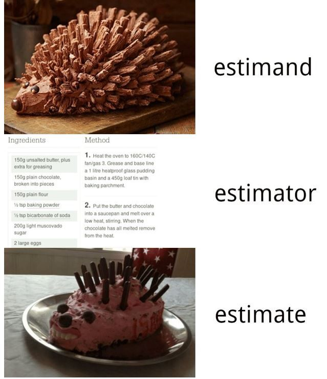
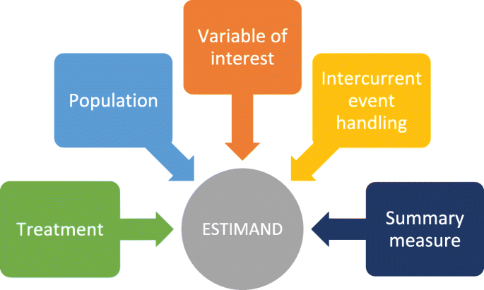
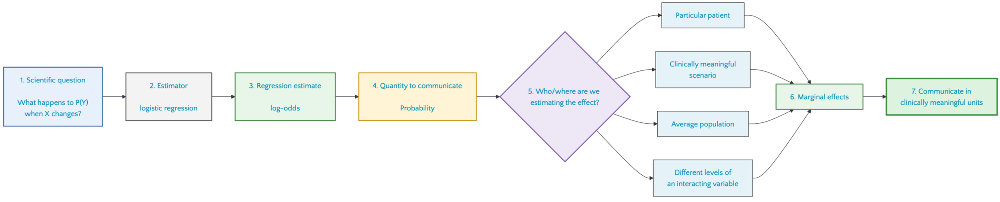
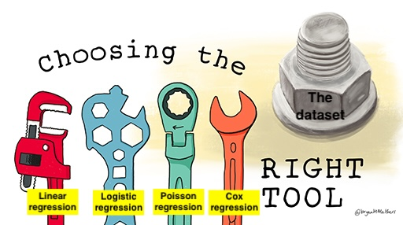
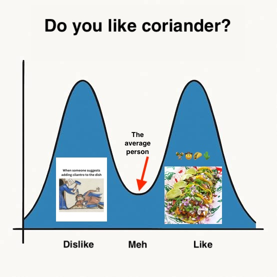

# Marginalizing the problem

<!--
### Editable in yaml
revealjs-plugins:
  - editable
filters:
  - editable
-->

```{r}
#| label: setup
#| echo: false

library(ggplot2)
library(dplyr)
library(readr)
library(marginaleffects)
library(tidyr)
```

## {.smaller .scrollable}

**Case 15: "The odds ratio is 0.65... and so what?"**

At the stroke research meeting, the biostatistician puts a slide on the screen.

> Thrombectomy vs. no thrombectomy: OR = 0.65

The clinical team pauses.

> "That sounds promising," someone says. "But what does 0.65 actually mean for a
> patient?"

The analysis comes from an observational study of patients with acute stroke.
The outcome is death within one year, and the researchers have fitted a logistic
regression model to account for differences between patients who received
thrombectomy and those who did not.

The statistician explains that the regression coefficient corresponds to an odds
ratio of 0.65.

Another question immediately follows:

> "But what we really want to know is whether patients have a lower probability
> of dying if they receive thrombectomy. Why are we talking about odds?"

Now the room gets filled with discussion.

Suppose 20% of patients in the control group die within one year. What would you
actually want to show a clinician---or a patient?

- An odds ratio of 0.65?
- The probability of death under each treatment?
- The absolute difference in probability of death?
- Something else?

And whose probability are we talking about?

- A particular patient with a particular age, diabetes status, and clinical
  profile?
- An older adult with diabetes?
- The average patient in this study?
- Or the population-level probability we would see if everyone received
  thrombectomy, compared with what we would see if no one received it?

These are related questions, but they are not the same question. The clinical
team decides to work through the problem one scientific question at a time.

1. Is thrombectomy associated with a different probability of death?
2. Does the effect differ for older adults with diabetes?
3. What does the model imply for the average stroke patient?
4. What if everyone could participate twice --- both in the treatment and the
   no-treatment group?

The team notices something --- the regression model has produced one
coefficient, but the researchers have several different scientific questions.

So they ask:

> What exactly is the model estimating---and how do we turn that into the
> quantity we actually want to know?

Your task is to make sure that the quantity we calculate and communicate answers
the scientific question we started with.

##

{.r-stretch fig-align="center"}

##

{.r-stretch fig-align="center"}

## {.center}

::: {.r-fit-text}
Reading Task: 15.4

**Communicating results of regression models**
:::

## {.smaller .scrollable}

**Discussion: "What do we actually want to know?**

> An observational study retrospecively investigates whether a new treatment
> reduces the risk of a complication after surgery. The researchers fit a
> logistic regression model and obtain 𝛽1 (odds ratio) as 0.65 for treatment vs.
> control.

**Discuss with our neighbor:**

1. What is the scientific question? What would you actually want to know about
   the treatment?
2. What is the model giving us? What exactly is the odds ratio of 0.65? Is it
   itself a clinical outcome or something else?
3. What would be easier to interpret? Imagine the complication occurs in 20% of
   patients in the control group. What kind of result would you rather show a
   clinician or patient: the odds ratio, a risk/probability, an absolute risk
   difference, or something else? Why?
4. What is the estimand? Try to state, in one sentence, the quantity you would
   ideally like to learn about.
5. If the model coefficient is not the scientific answer, what role does the
   model play?

## Workflow

{.r-stretch fig-align="center"}

## The dataset

```r
?medisr::thrombectomy
```

Read for yourself...

## Scientific questions

::: {.r-fit-text}
1. Does the population who got thrombectory have lower probability of death at
   1-year follow-up after stroke compared to the population who did not get
   thrombectomy?

2. What is the effect of thrombectory in older adults with diabetes, compared to
   older adults without diabetes?

3. What is effect of the average person profile in the sample?

4. What would be the average probability of death, had all participants received
   thrombectomy, compared to not receiving it?
:::

## The estimand {.smaller .scrollable}

We are interested in the probability of death at 1-year follow-up:

$$
  P(death = 1 | X)
$$

for an observational study looking at the effect of thrombectomy after stroke:

```{r}
#| label: smoking-dag
#| echo: false

dag <- ggdag::dagify(
  death ~ trt + age + diabetes + hyp_ten,
  trt ~ age + diabetes + hyp_ten,
  hyp_ten ~ diabetes + age,
  diabetes ~ sex + age
)

ggdag::ggdag(dag) +
  ggdag::geom_dag_point(size = 20) +
  ggdag::geom_dag_text(size = 3) +
  ggdag::theme_dag()

# ggdag::ggdag(dag, text = FALSE, use_labels = "name")

# dagitty::adjustmentSets(dag,exposure="trt","death")
```

## The estimand {.smaller .scrollable}

- We need to adjust for age, hypertension and diabetes.
- We will still incl. sex, as the dataset is unbalanced and we want to adjust
  for that bias.

```{r}
#| label: smoking-dag2
#| echo: false

dag <- ggdag::dagify(
  death ~ trt + age + diabetes + hyp_ten,
  trt ~ age + diabetes + hyp_ten,
  hyp_ten ~ diabetes + age,
  diabetes ~ sex + age
)

ggdag::ggdag(dag) +
  ggdag::geom_dag_point(size = 20) +
  ggdag::geom_dag_text(size = 3) +
  ggdag::theme_dag()

# ggdag::ggdag(dag, text = FALSE, use_labels = "name")

# dagitty::adjustmentSets(dag,exposure="trt","death")
```

## The estimator



## The estimator


## Our estimator

- follow individuals for one year
- no censoring
- probability of death is relative high
- *n* can be defined as the sample size

$$
  y_i = Binomial(n,p_i) \\
  logit(p_i) = α + βx_i
$$

where *n* is the number of observations and *p* is the probability of death.

## Our estimator {.smaller .scrollable}

The logit function is defined as the *log-odds*:

$$
  logit(p_i) = log(\frac{p_i}{1 - p_i})
$$

The "odds" of an event is just the probability it happens divided by the
probability it does not happen. In other words:

$$
  log(\frac{p_i}{1 - p_i}) = α + βx_i
$$
To figure out the definition of *p_i*, we do some algebra to solve for $p_i$:

$$
  p_i = \frac{exp( α + βx_i)}{1 + exp(α + βx_i)}
$$
The above function is the **logistic**

- Note that the log-odds space is linear (what we model)
- The logistic space is the sigmoidal shape (the transformation)

## The statistical model {.smaller .r-stretch}

::: {.r-fit-text}
$$
  logit( \text{death at 1 year followup}) = α + β1_{thrombectomy}
                                            + β2_{diabites} + β3_{age} \\
  + β4_{hypertention} + β5_{sex} + β6_{thrombectomy×diabites} \\
  + β7_{thrombectomy×age}
  + β8_{thrombectomy×hyptertension} + β9_{thrombectomy×sex} \\
$$
:::

## In R

```{r}
#| label: thrombectomy-model
#| code-line-numbers: "2|6|16"
#| echo: true

thrombectomy <- medisr::thrombectomy |>
    mutate(
        death_1year_followup = if_else(time_to_death < 365 & death ==1,1,0),
        age_at_diagnosis = as.numeric(age_at_diagnosis)
    )

th_model <- glm(
    death_1year_followup ~ thrombectomy +
        prior_diabetes +
        age_at_diagnosis +
        prior_hypertention +
        sex +
        thrombectomy:prior_diabetes +
        thrombectomy:age_at_diagnosis +
        thrombectomy:prior_hypertention +
        thrombectomy:sex,
    family = binomial(link = "logit"),
    data = thrombectomy
)
```

```r {code-line-numbers=""}
thrombectomy <- medisr::thrombectomy |>
    mutate(death_1year_followup = if_else(time_to_death < 365 & death ==1,1,0),
    age_at_diagnosis = as.numeric(age_at_diagnosis)
    )

th_model <- glm(
  death_1year_followup ~ thrombectomy +
        prior_diabetes +
        age_at_diagnosis +
        prior_hypertention +
        sex +
        thrombectomy:prior_diabetes +
        thrombectomy:age_at_diagnosis +
        thrombectomy:prior_hypertention +
        thrombectomy:sex,
        family = binomial(link = "logit"),
  data = thrombectomy
)
```

## The coefficients

```{r}
#| label: smoking-output

th_model |>
    parameters::parameters(exponentiate=TRUE) |>
    select(c(Parameter,Coefficient,SE)) |>
    rename(Odds_ratio=Coefficient)
```

##

::: {.columns}
::::: {.column}
{.r-stretch fig-align="center"}
:::::
::::: {.column}
::::::: {.fragment}
{.r-stretch fig-align="center"}
:::::::
:::::
:::

## {.r-stretch fig-align="center"}

::: {.r-fit-text}
Read *Step 3: Stock with regression coefficients...*
:::

## Mistake #1

> Don't read coefficient, thinking it generalizes to the sample!

## Mistake #2

> Confusing OR for a probability

## Mistake #3

> 1-unit change OR gives different probability for two individuals

## {.r-stretch fig-align="center"}

::: {.r-fit-text}
Read *Step 4: Clear communication --- transforming coefficients*
:::

1. Run all code examples and
2. Make predictions for

- A 70 year-old female without diabetes, hyptersions and thrombectomy
- A 70 year-old male without diabetes but having hyptersions and received
  thrombectomy

## Step 5-7: Model-based transformations

- A model is conditional on it's sample

- Regression coefficients let's us predict any arbitrary sample *that is
  conditional on being explained by the model!*

- post-hoc weights on certain participant profiles, so that our estimate is
  targeting a specific aspect of the model inference.

Questions that form such discussions can be:

- A particular patient?
- A clinically meaningful scenario?
- The average population?
- Different levels of an interacting variable?

## RQ 1: Our sample as reality

> "Does the population who got thrombectory have lower probability of death at
> 1-year follow-up after stroke compared to the population who did not get
> thrombectomy?"

## {.r-stretch fig-align="center"}

::: {.r-fit-text}
Can we use the model coefficient for `thrombectomy`? 👀
:::

```{r}
#| label: smoking-output3

th_model |>
    parameters::parameters(exponentiate=TRUE) |>
    select(c(Parameter,Coefficient,SE)) |>
    rename(Odds_ratio=Coefficient)
```

##

{.r-stretch fig-align="center"}

##

Here, the odds ratio is 2.20 ...

::: {.fragment}
> when all interacting variables are at their reference/zero values. In
> particular, the interpretation depends on how age is coded/centered and on the
> reference categories for diabetes, hypertension, and sex.

But how intuitive is that? 👀
:::

##

If we don't supply a newdata grid, the predictions() function will take all
participants in our sample and compute predictions for them, one by one:

```{r}
#| echo: true
#| label: pred1

p = predictions(th_model)
p
```

##

You can see that the row length is the same as the original dataset:

```{r}
#| echo: true
#| label: check-nrow

nrow(p)
nrow(thrombectomy)
```

- A table with 1023 rows is not super intuitive and nice to make inference from.

> Why can we do about that?

::: {.fragment}
1. Make a plot to illustrate it all visually, or
2. take the average of all these predictions
:::

##

```{r}
#| label: plot-everything

library(patchwork)

p = predictions(th_model)

# Histogram
p1 = ggplot(p) +
  geom_histogram(aes(estimate, fill = factor(thrombectomy))) +
  labs(x = "Pr(outcome = 1)", y = "Count", fill = "thrombectomy") +
  scale_fill_grey()

# Empirical Cumulative Distribution Function
p2 = ggplot(p) +
  stat_ecdf(aes(estimate, colour = factor(thrombectomy))) +
  labs(x = "Pr(outcome = 1)",
       y = "Cumulative Probability",
       colour = "thrombectomy") +
  scale_colour_grey()

# Combined plots
p1 + p2
```

## Design is not balanced!

```{r}
#| label: imbalance

table(thrombectomy$thrombectomy)
```

about 0.4301075 received thrombectomy.

## Marginalizing the problem

We can compute the average for them by using avg_predictions()

```{r}
#| label: avg-pred1
#| echo: true

avg_predictions(th_model)
```

So the average probability of death at the 1-year follow-up is 26.7%.

This is a reasonable estimate for answering the question

> "how many Danes die at 1-year follow-up after stroke?"

##

However, as we now know that the groups are unbalanced, this is not a good
estimate for the treatment effect! And it doesn't have the granularity to
address more nuanced questions of sub-population level.

Finally, to compute the average for the patients receiving thrombectomy and
those who did not, we can group the average for these conditions

```{r}
#| label: avg-pred2
#| echo: true

avg_predictions(th_model, by="thrombectomy")
```

## Can we do better?

the **risk difference** or the **risk ratio**.

$$
  RD = 0.214 - 0.307 = -9.3
$$
or a 9.3% points lower predicted risk of death on the absolute scale.

$$
  RR = \frac{0.214}{0.307} = 0.697
$$
or a 30% lower predicted risk of death on the relative scale.

So we conclude that:

> The model-estimated 1-year mortality was 30.7% in the absence of thrombectomy
> and 21.4% under thrombectomy, corresponding to an un-adjusted absolute risk
> difference of −9.3 percentage points

## RQ 2: Treatment effect of older adults conditional on diabetes status

> "What is the effect of thrombectory in older adults with diabetes, compared to
> older adults without diabetes?"

::: {.fragment}
Here, we're interested specifically in a sub-population.

we need to consider multiple variables (`diabetes` and `thrombectory`) *and the
proportions* who have this profile in our sample.
:::

## Making new grids

```r
datagrid(
    prior_diabetes = 1,
    thrombectomy = c(0, 1),
    age_at_diagnosis=c(80:90),
    model = th_model
)
```

```{r}
#| label: diab-head

p = predictions(
    th_model,
    newdata = datagrid(
        prior_diabetes = 1,
        thrombectomy = c(0, 1),
        age_at_diagnosis=c(80:90)
    )
)

p |> head()
```

## Estimated Marginal Mean

```{r}
#| label: diabetes-result
#| echo: true

grid_oi <- datagrid(
    age_at_diagnosis=c(80:90),
    prior_diabetes = unique,
    thrombectomy = unique,
    model = th_model
)

p1 = plot_predictions(th_model, newdata = grid_oi, by = "thrombectomy")
p2 = plot_predictions(th_model, newdata = grid_oi, by = c("thrombectomy", "prior_diabetes"))
p1 + p2
```

##

```{r}
#| label: diabetes-result2
#| echo: true

avg_predictions(
    th_model,
    by = c("thrombectomy", "prior_diabetes"),
    newdata = datagrid(
        age_at_diagnosis=c(80:90),
        prior_diabetes = unique,
        thrombectomy = unique
    )
)
```

- from 42.3% probability of death without treatment to 26.7% for non-diabetic.

- from 66.2% probability of death without treatment to 61.6% for non-diabetic.

## RQ:3 "The average person"

> What is effect of the average person profile in the sample?

##

## Our sample is unbalanced

First of all, males are nearly 48% propensity of receiving thrombectory or not,
while it's only 38% of females.

```{r}
#| label: sex-sample
#| echo: true

xtabs(~ thrombectomy + sex, data=thrombectomy)
```

```{r}
#| label: diabetes-sample
#| echo: true

xtabs(~ thrombectomy + prior_diabetes, data=thrombectomy)
```

- more males in the treatment group
- few with diabetes --- 10-15% in our sample
  - 6.4% in DK population
  - A balanced design should have 50%

## The balanced grid

```{r}
#| code-line-numbers: "1-2|4-11|13-17"
#| label: balanced

age_mean <- mean(thrombectomy$age_at_diagnosis)
age_sd <- sd(thrombectomy$age_at_diagnosis)

grid_oi <- datagrid(
    model = th_model,
    prior_diabetes = unique,
    prior_hypertention = unique,
    sex = unique,
    thrombectomy = unique,
    age_at_diagnosis = c(age_mean-age_sd, age_mean, age_mean+age_sd)
    )

predictions(
    th_model,
    by = "thrombectomy",
    newdata = grid_oi
)
```

## {.r-stretch .center}

::: {.r-fit-text .}
Is "the average person"! 👀
:::

##

{.r-stretch fig-align="center"}

## RQ 4: "What if" 🤔

> What would be the average probability of death, had all participants received
> thrombectomy, compared to not receiving it?

##

```{r}
#| echo: true

p = predictions(th_model, variables = list(thrombectomy = 0:1))
nrow(p)
```

##

```{r}
plot_predictions(
    th_model,
    newdata=datagrid(
        thrombectomy = c(0,1),
        grid_type="counterfactual"
    ),
    by="thrombectomy"
)
```

```{r}
#| echo: true

avg_predictions(th_model, variables = list(thrombectomy = 0:1))
```

::: {.fragment}
> For each individual in the Syntheric DanStroke medisr sample, what is the
> predicted probability of death in the counterfactual world where they receive
> thrombectory, and where they do not?
:::

## Can we do better?

**Risk difference**

```{r}
#| echo: true
#| code-line-numbers: "1"
#|
avg_comparisons(
    th_model,
    variables = "thrombectomy"
    )
```

> A risk difference of -0.0317, favoring thrombectomy

The `comparisons()` function above computed the predicted probability of
mortality (`death_1year_followup == 1`) for each observed row of the data in two
counterfactual cases: when `thrombectomy == 1`, and when `thrombectomy == 0`.
Then, it computed the differences between these two sets of predictions.
Finally, it computed the population-average of risk differences.

##

**population-averaged (marginal) adjusted risk ratios:**

```{r}
#| echo: true

avg_comparisons(
    th_model,
    variables="thrombectomy",
    comparison = "lnratioavg", # Calculates adjusted Risk Ratio
    transform = exp # then exponentiates
    )
```

> The model-estimated 1-year mortality was 27.1% in the absence of thrombectomy
> and 23.9% under thrombectomy, corresponding to an adjusted risk ratio of
> 0.883.

##

::: {.r-fit-text}
**Time for exercises** 🎉
:::

{.r-stretch fig-align="center"}

<!--
## Deadly venom - according to whom?


::: notes
Its venom contains delta-hexatoxins (such as robustoxin) that severely target
the nervous systems of humans and other primates, while most other
mammals---like cats, dogs, and rabbits---are largely unaffected.
:::

## x's effect on y - simple

Sometimes, we just want to investigate one variable's effect on an outcome *the
estimand = smoking on lung cancer*

```{mermaid}
%%| label: lin-reg

flowchart LR
    X[X] -> Y[Y]
```

$y ~ x$

::: {.fragment}
::::: {.callout-important}
But we know this model is biased! There are known confounding
:::::
:::

## So we add variables we know are confounded... {.smaller .scrollable}

::: {.columns}
::::: {.column}
```{mermaid}
%%| label: lin-reg2

flowchart LR
    X[X] -> Y[Y]

    C1[Age] -> Y
    C2[Income] -> Y
    C3[Education] -> Y
    C4[Region] -> Y
    C5[...] -> Y
```
:::::
::::: {.column}
$$
  Y = β_0 + β_1Age + β_2Income + β_3Education + β_4Region + β_n... + ε
$$
:::::
:::

## Still, we only care about x! {.smaller .scrollable}

```{mermaid}
%%| label: lin-reg3

flowchart LR
    X((X)) -> Y[Y]

    C1[Age] -> Y
    C2[Income] -> Y
    C3[Education] -> Y
    C4[Region] -> Y
    C5[...] -> Y

    style X stroke:#d62728,stroke-width:4px
```

No problem! We simply interpret the coefficient of X, keeping all other
variables at 0.

::: {.fragment}
::::: {.callout-important}
What if we add interactions? 😨🫠
:::::
:::

## In session 11, we learned...

```r
model_interact <-
    lm(MaxHR ~ Age + HD + Age:HD,
    data = hd_data)

plot_predictions(
    model_interact,
    condition = c("Age", "HD")
) +
    ylab("Predicted max heart rate")
```

We cannot say `age` have and effect on `HD`, as this effect is strong in younger
age; but the effect dies off at older age.

## The truth is complicated - we need a simple answer!

Often, we don't care about *every possible* value of age. We might be interested
in a specific age group, or we might be interested in the average effect of all
age groups.

::: {.fragment}
::::: {.callout-important}
This is where marginal effects comes to the rescue 🎉🥳
:::::
:::

## Marginalizing the problem

```{mermaid}
flowchart LR

    X((X)) -> Y[Y]

    subgraph Marginalized covariates
        C1[Age]
        C2[Income]
        C3[Education]
        C4[Region]
        C5[...]
    end

    C1 -> Y
    C2 -> Y
    C3 -> Y
    C4 -> Y
    C5 -> Y

    style X stroke:#d62728,stroke-width:4px
```

## How might we do that?

**Three good way of doing this:**

1. predicting the effect at a specific age
2. predicting the average effect of all participants' age in the current study
3. predicting the average effect of any individual's, considering we want to
   generalize to the population

# Predicting the effect at a specific age

## Predicting the effect at age 50 {.smaller .scrollable}

We already learned this for linear regression: What is the predicted max heart
rate for:

- a 80 year old with heart disease?
- a 36 year old without heart disease?

```r
#| label: params-model-interact

parameters::parameters(model_interact) |>
    knitr::kable()
```

```r
#| output: true
#| label: using-predictions-one-age

age2use <- 50

age50_HD_true <- as.numeric(
    coef(model_interact)[1] +
        coef(model_interact)[2]*age2use +
        coef(model_interact)[3]*1 +
        coef(model_interact)[4]*age2use
    )

age50_HD_false <- as.numeric(
    coef(model_interact)[1] +
        coef(model_interact)[2]*age2use +
        coef(model_interact)[3]*0 +
        coef(model_interact)[4]*0
        )
```

::: {.fragment}
```r
#| output: true
#| label: using-predictions-one-age-answers

paste(glue::glue("age50_HD_true = {round(age50_HD_true,1)}"))
paste(glue::glue("age50_HD_false = {round(age50_HD_false,1)}"))
```
:::

## Predicting the effect of HD on maxHR at age 50 {.smaller .scrollable}

```r
#| label: plt-repel-pred

# Annotation data.frame
ann <- tibble(
  Age = c(age2use, age2use),
  HD = factor(c(0, 1)),  # adjust if HD is logical/character
  pred = c(age50_HD_false, age50_HD_true),
  label = c(
    paste0("Age=50\nHD=0\n", round(age50_HD_false, 1)),
    paste0("Age=50\nHD=1\n", round(age50_HD_true, 1))
  )
)


plot_predictions(
    model_interact,
    condition = c("Age", "HD")
) +
  geom_point(
    data = ann,
    aes(x = Age, y = pred),
    size = 3
  ) +
  ggrepel::geom_label_repel(
    data = ann,
    aes(x = Age, y = pred, label = label),
    seed = 123,
    box.padding = 0.5,
    point.padding = 0.3
  ) +
  ylab("Predicted max heart rate")
```

## How?

```r
#| echo: true
#| eval: false
#| label: how-predictions-one-age

age2use <- 50

age50_HD_true <- as.numeric(
    coef(model_interact)[1] +               # intercept
        coef(model_interact)[2]*age2use +   # age
        coef(model_interact)[3]*1 +         # HD = true
        coef(model_interact)[4]*1*age2use   # HD = true and age
    )

age50_HD_false <- as.numeric(
    coef(model_interact)[1] +               # intercept
        coef(model_interact)[2]*age2use +   # age
        coef(model_interact)[3]*0 +         # HD = false
        coef(model_interact)[4]*0*age2use   # HD = false
        )
```

## Using {marginaleffects}

```r
#| label: how-predictions-one-age-margeff
#| code-line-numbers: 2|3|4|
#| echo: true

model_interact |>
    marginaleffects::predictions(
        newdata = datagrid(Age = 50),
        variables = "HD"
        )
```

2. `predictions()` will compute predictions
3. `newdata` to make a new dataset with `datagrid`
6. `variables` takes the variable we examine

::: {.fragment}
*But is this significantly different?*
$E(Y ∣ HD = yes,Age = 50) − E(Y ∣ HD = no,Age = 50)$
:::

## Hypothesis test on the effect of HD at age 50

```r
#| label: hypothesis-fifty-margeff

model_interact |>
    marginaleffects::comparisons(
    newdata = datagrid(Age = 50),
    variables = list(
            HD = c("no heart disease", "yes, heart disease")
            )
)
```

$E(Y ∣ HD = yes,Age = 50) − E(Y ∣ HD = no,Age = 50)$

::: {.callout-important}
We need the covariance between the two predicted values to get the correct
standard error and p-value. That's why we should use `comparisons()` or
`hypotheses()` rather than trying to test it from the two confidence intervals.
:::

## Uncertainty

```r
#| label: delta-method

b <- coef(model_interact)
b[2] - b[3] # which coefficients to diff

V <- vcov(model_interact)

J <- matrix(c(0,1,-1,0), ncol = 1) # which covar to include

variance <- t(J) %*% V %*% J
sqrt(variance)
```

Suppose your model is

$η = β0​ + β1​Age + β2​HD + β3​(Age × HD)$

and you're interested in the difference in predictions at Age = 50:

$g(β) = y^​(HD = 1,Age = 50) − y^​(HD = 0,Age = 50)$

The delta method says:

$Var(g(β^)) ≈ ∇g(β^)TVar(β^)∇g(β^)$

The trick is finding the gradient $∇g$

The variance is: $Var(g) = L⊤VL$

```r
#| label: delta-method-full

x0 <- c(1, 50, 0, 0)     # intercept, 50yo, HD = 0, interaction
x1 <- c(1, 50, 1, 50)    # intercept, 50yo, HD = 1, interaction
L  <- x1 - x0

V <- vcov(model_interact)

est <- drop(L %*% coef(model_interact)) # drop for matrix[1,1] to scalar
se  <- sqrt(drop(t(L) %*% V %*% L)) # go from var to se using sqrt
z   <- est / se
```

# Predicting the average effect of HD for all specific age levels for the study participants

## Imagine...

We do this for all combinations of age and HD we have in our data set?

We'd get *the average effect of all participants' age on HD in the current
study*

*Ready for a lot of homework?*

## {marginaleffects} to the rescue

```r
head(hd_data) |>
    select(Age,HD) # MaxHR
```

```r
library(marginaleffects)
library(tinytable)

pred <- model_interact |>
  predictions(
    newdata = hd_data[1:5, ],
    variables = list(
      HD = c("no heart disease", "yes, heart disease")
    )
  )

#pred |>
#  select(rowid, Age, HD, estimate) |>
#  tt()

pred |>
  select(rowidcf, Age, HD, estimate) |>
  tidyr::pivot_wider(          # rowid = row in the expanded counterfactual dataset (1:10)
    id_cols = c(rowidcf, Age), #rowidcf = original observation being counterfactually modified (1:5)
    names_from = HD,
    values_from = estimate
  ) |>
  tt()
```

## It's easy!

```r
#| echo: true

model_interact |>
  predictions(
    newdata = hd_data, # can be left alone
    variables = list(
      HD = c("no heart disease", "yes, heart disease")
    )
  )
```

## Now, we average all HD = 1 and HD = 0 separately

```r
model_interact |>
  avg_predictions(
    newdata = hd_data, # can be left alone
    variables = list(
      HD = c("no heart disease", "yes, heart disease")
    )
  )
```

## Counterfactuals

This is the *counterfactual* estimate, where we *predict* the maxHR for all
participants, had we observed them with and without HD.

# Predicting the average effect, considering we want to generalize to a population

## How does our sample look?

```r
#| label: looking-at-cohort

hd_data |>
    group_by(HD) |>
    summarize(
        n = n()
    )

hd_data |>
    ggplot(aes(Age)) +
    geom_histogram()
```

## How would we like our target population to be?

We could consider

::: {.columns}
::::: {.column}
Making equal number of patients with HD

- samples with highly unbalanced design (rare diseases)
- weights can be meaningful, but can also be desieving
:::::
::::: {.column}
Making age more informative

- focus on 50-70
- clinically relevant
- most of our data anyway
:::::
:::

## {marginaleffects} can predict the target population

```r
target_pop <- tidyr::expand_grid(
         Age = c(50:70),
         HD = c("no heart disease", "yes, heart disease")
     )

model_interact |>
  avg_predictions(
    newdata = target_pop,
    variables = list(
      HD = c("no heart disease", "yes, heart disease")
    )
  )
```

## Hypothesis testing on the target population

```r
model_interact |>
  avg_predictions(
    newdata = target_pop,
    variables = list(
      HD = c("no heart disease", "yes, heart disease")
    ),
    hypothesis = "b1 = b2"
  )
```

So this model

- estimates a 12.5 difference in maxHR between HD and no-HD in the age group
  50-70 years old
- the estimate has a SE of 2.63 and 95%CI[7.37, 17.7]
- the *z*-statistic is 4.76 and the *p*-value is < 0,001

so we reject the null that HD has no effect on maxHR given the average effect of
an age group between 50-70.

::: {.fragment}
**However** - *is this a clinically meaningful difference?*

How much functional gain/loss does going from 138 to 151 BMI really mean in this
age group?
:::

::: {.hidden}
Reading Task: Reporting Incidence Rate Ratio or Counts

::::: {.fragment}
**Question**: Should we report the incidence rate ratio or the counts for each
group?

- Absolute Perspective: Mosquitoes cause the most deaths annually.
- Relative Perspective: Shark attacks are rarer but more dangerous per
  encounter.
:::::

**Tip**: Condition on `baseline_seizures`.
:::

-->
