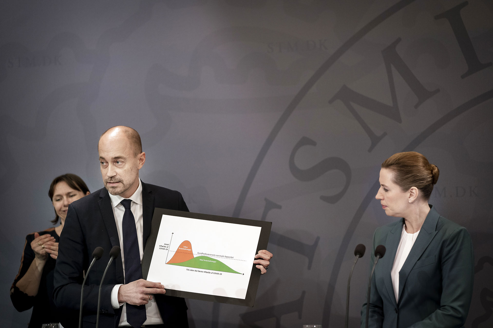
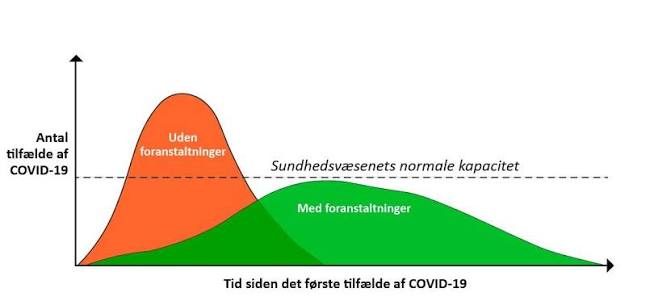
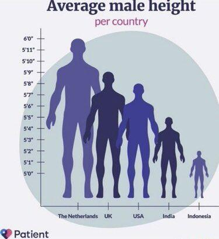
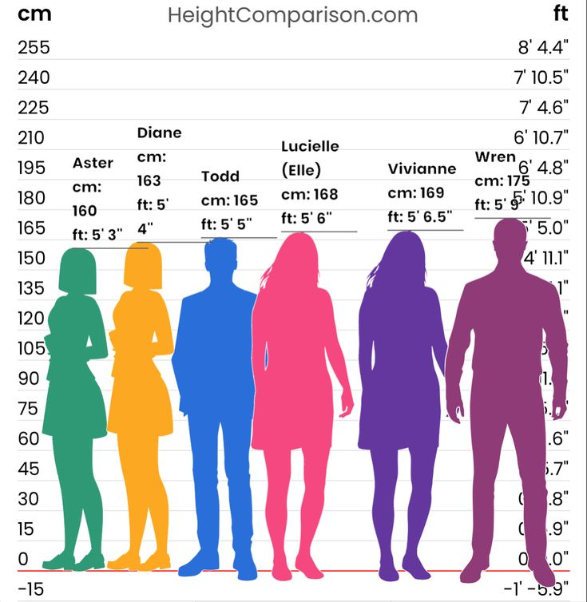
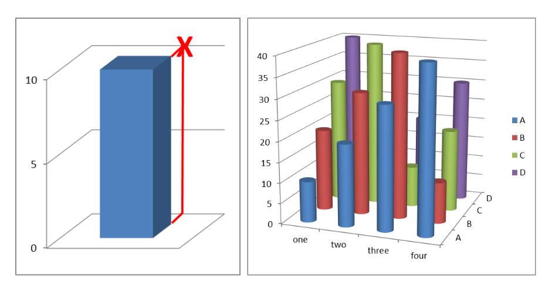
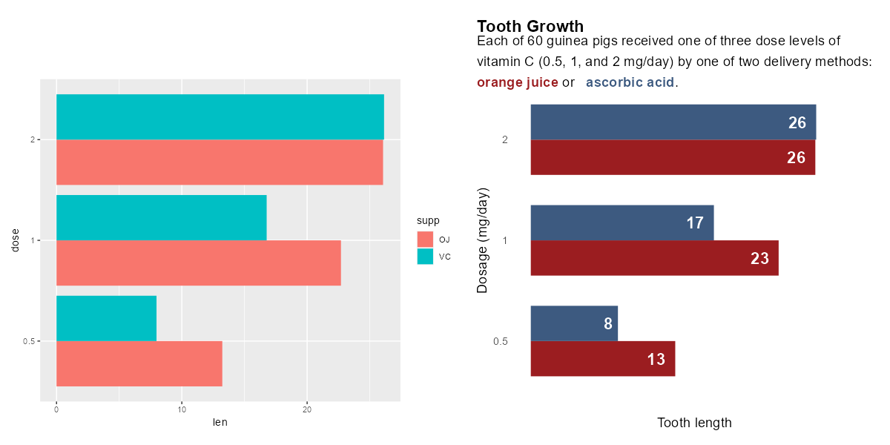

# Data visualizations {.center .align-center}

Start after section 13.3 Proceed with section 13.4

## Why Visualize Data? {.r-stretch .center style="text-align: center;"}

## Why Visualize Data? {.smaller .scrollable}

Which of these are easiest to draw information from:

::: panel-tabset
### Table

```{r}
#| echo: false
#| warning: false
#| label: viz-is-powerful

x <- seq(0, 2 * pi, length.out = 20)
y <- round(sin(x) * 10, 1)

dat <- data.frame(month = x, temperature = y)

dat |>
  gt::gt()
```

### Plot

```{r}
#| label: viz-is-powerful2
#| echo: false
#| warning: false

dat |>
  ggplot2::ggplot(ggplot2::aes(month, temperature)) +
  ggplot2::geom_point()
```
:::

## Public communication

{fig-align="center"}

## Public communication

{fig-align="center"}

## When plots goes wrong...

{fig-align="center"}

## A simple fix

{fig-align="center"}

## What you read today:

[Royal Statistical Society
guide](https://royal-statistical-society.github.io/datavisguide/docs/principles.html)

## How to get -03

{fig-align="center"}

## Thinking about communication

{fig-align="center"}
